# 嵌入式Linux 软件笔记

form：华清远见

开发平台：Ubuntu  编译器：gcc  编辑器：Vim

---


# 环境搭建：

参考技术博客，虚拟机VMwa Workstation最新版 安装Ubuntu最新版

下面的配置是基于华清远见的课程，安装14.4版本ubuntu

### 虚拟配置:

1个1核处理器

1G内存

20G硬盘

### 硬盘分区：

/ 根目录 5G

/boot 引导程序 200M

Swap 虚拟内存（交换区） 2G

/home 用户文件 剩下的空间

---


# termina的基础命令

## Ubuntu系统teminal的常用命令

命令严格区分大小写 

ctrl+alt+t快速打开teminal

ls 打开文件夹的目录

cd 进入文件夹

cd .. 退回到上一个文件夹

ls -l 打开目录并显示文件详细信息

Cat -s -b 其中，Cat表示在teminal中查看文件内容，-s 表示合并空行，-b 表示加行序号

cp test.c test1.c 在同一文件夹把文件test.c复制为test1.c

programe 程序

---


# 数据类型

所有数据（数字、字母、字符&字符串、特殊符号）最后都会变成2进制（机器语言）

---


## 数值数据

| 十六进制 HEX | 十进制 DEC | 二进制 BIN |
| :----------: | :--------: | :--------: |
|     0x0      |    000     |    000     |
|     0x1      |    001     |    001     |
|     0x2      |    002     |    010     |
|     0x3      |    003     |    011     |
|     0x4      |    004     |    100     |
|     0x5      |    005     |    101     |
|     0x6      |    006     |    110     |
|     0x7      |    007     |    111     |
|     0x8      |    008     |    1000    |
|     0x9      |    009     |    1001    |
|     0xA      |    010     |    1010    |
|     0xB      |    011     |    1011    |
|     0xC      |    012     |    1100    |
|     0xD      |    013     |    1101    |
|     0xE      |    014     |    1110    |
|     0xF      |    015     |    1111    |
|     0x10     |    016     | 0001 0000  |
|     0x11     |    017     | 0001 0001  |
|     0x12     |    018     | 0001 0010  |
|     0x13     |    019     | 0001 0011  |
|     0x14     |    020     | 0001 0100  |
|     0x15     |    021     | 0001 0101  |
|     0x16     |    022     | 0001 0110  |
|     0x17     |    023     | 0001 0111  |
|     0x18     |    024     | 0001 1000  |
|     0x19     |    025     | 0001 1001  |
|     0x1A     |    026     | 0001 1010  |
|     0x1B     |    027     | 0001 1011  |
|              |            |            |

---


## 非数值数据

根据编码标准转化为二进制

如：ASCII码表

---


# 编译器

gcc（GNU Compiler）

调用gcc的相关SHELL指令

gcc hello.c 最基础的编译命令 生成 a.out

gcc hello.c -o hello.exe 自定义编译后的文件名

gcc hello.c -wall表示编译hello.c并生成详细的错误提示

cat hello.c 把程序打印到teminal

# shell的使用

shell工具是对操作系统的指令的封装，用于实现用户与linux内核的交互

若干shell命令行+控制语句=shell脚本

linux内核接受到shell工具转译后的指令，可以控制相关硬件执行操作

硬件执行操作后会给shell提供反馈

相当于用户通过shell工具，间接的控制了硬件

shell工具简化了linux内核指令，使操作硬件更方便快捷

## shell的类型

bash shell

zshell


## 标准IO

控制高端的硬件必须通过操作系统内核来实现

不同操作系统内核提供了不同的API接口

用库函数将常用的一些操作系统的API接口封装成统一标准的新API接口

这个新的API接口就是标准IO，如:  <stdio.h>在所有主流操作系统上使用C语言

标准IO方便了程序在不同操作系统间的移植

---


# C语言

## 01数据类型

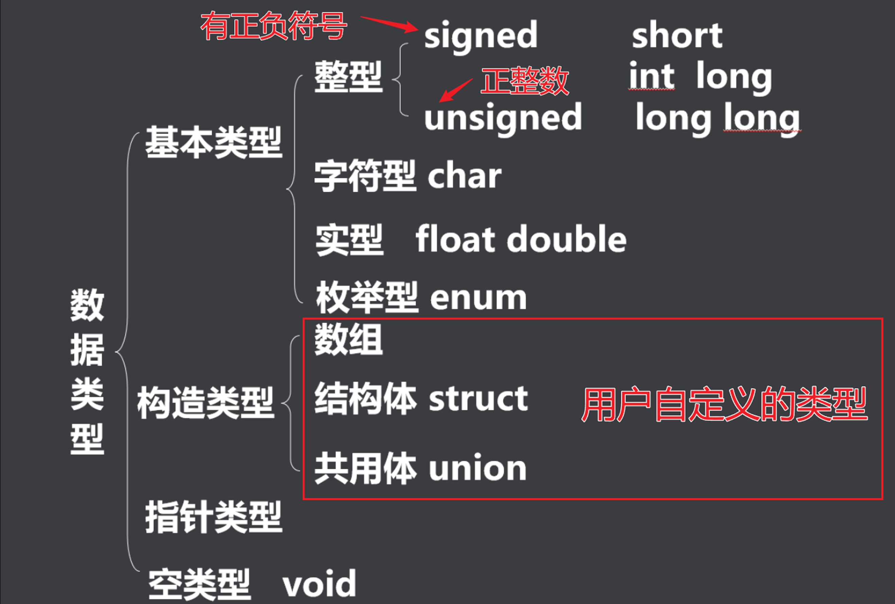

### bool类型

bool不是基本数据类型，需要调用<stdbool.h>中的宏定义bool

```c
#include <stdio.h>
#include <stdbool.h>
bool = not_zero = true;//非零的任何数据都识别为1
bool = zero =false;

```

不同硬件平台下相同的数据类型占用的内存大小不一样

### 基本数据类型

下面是32bit的ubuntu下的数据长度


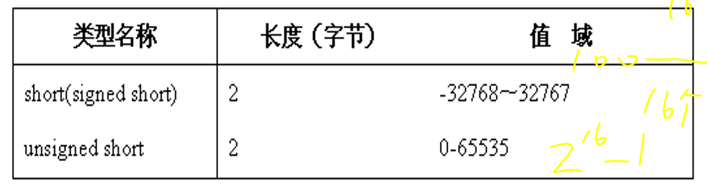

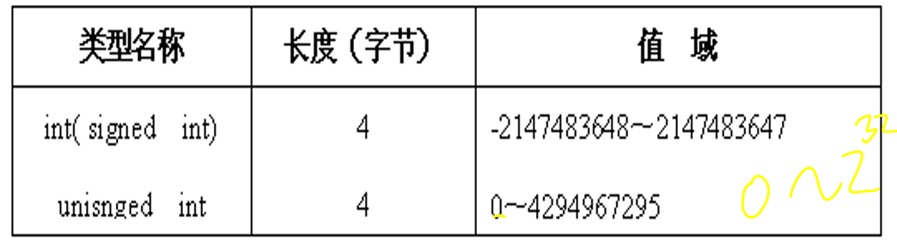

对于不同硬件平台可以调用sizeof(datetype)查看不同数据类型的长度(不是变量)

直接打开 /usr/include/limits.h也可以查看各种数据类型的长度

数据范围溢出会乱码，但是编译器不一定会报错，需要人工检查

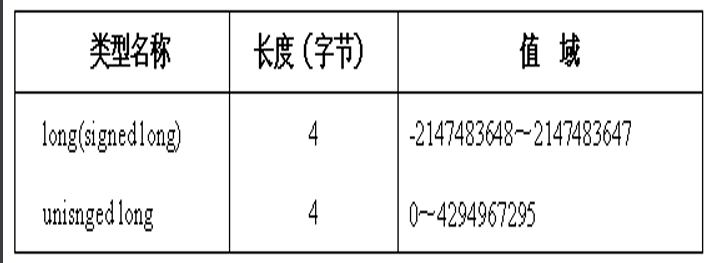

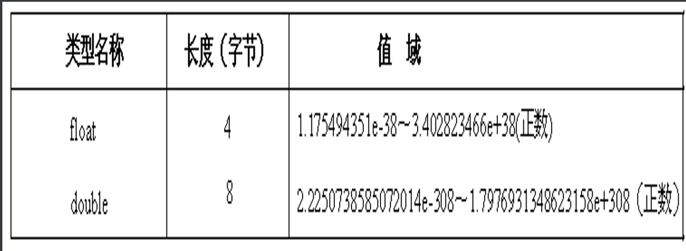

### 常量


char  本质上还是int 转换的规则就是ASCII

例如：A=65 a=65+32=97

SHELL 指令 man ASCII可以查看具体转换规则

---

宏定义 常量

方便代码维护

#define A B    把A替换为B，可修改B的值，相当于复制粘贴

预处理不会占用资源

存入寄存器的变量不能取地址&，即指针不能控制

static 静态类型 

正常情况下每次循环都会销毁局部变量

static修饰的变量默认初始化为0，并且不入轮回（值不被销毁）

调用其他文件中的全局变量，需要用extern修饰这个变量

如果全局变量被static修饰，无法被extern调用

---


## 02运算符号

### 算数运算符

按照小学数学来就行

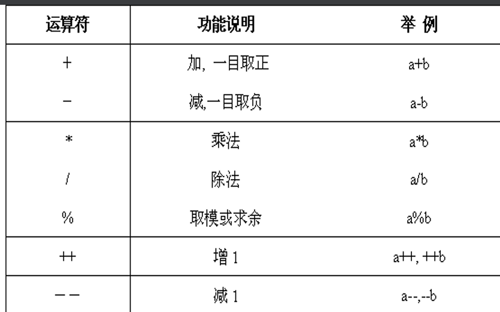

### 关系运算符

判断0和1，即假和真，false or true

可以在括号外加 ！取反

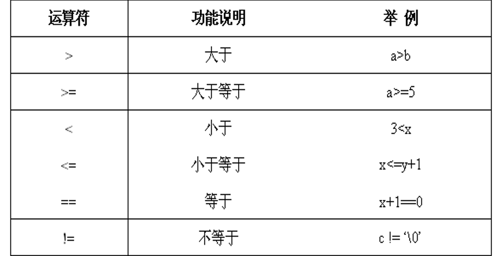

### ==逻辑运算符==

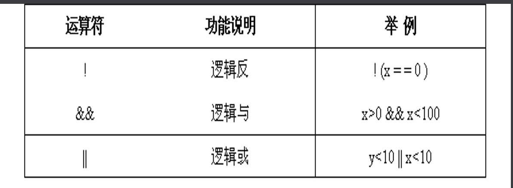

逻辑与 相当于串联开关

逻辑或 相当于并联开关 

### ==位运算符号==

进行位运算时候一定要把数据转换为==二进制==

在操作寄存器配置时经常用到位操作

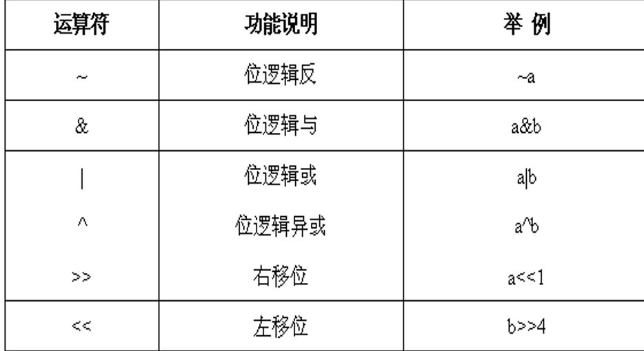

位逻辑反 ：在~后的二进制数每一位都分别取反

位逻辑与：在&两侧的二进制数对应的每一位都分别进行逻辑与

位逻辑或：在|两侧的二进制数对应的每一位都分别进行逻辑或

---


==位逻辑异或==：（==异或==表示相同位0，不同为1）

对^两侧对应的每一位二进制数分别进行异或

左移位：在<<左侧是被操作的变量，右侧是操作变量向左移动的位数

```c
uchar a=0xe4, b;
b=a<<3;//a转化为二进制：1110 0100
//左移3位相当于：去掉左边3位，然后在末尾补上3位0，
//b=0010 0000
```

右移位：>>原理同上。

---

### ==赋值复合运算符==

将右边的表达式的运算结果赋值给左边的变量

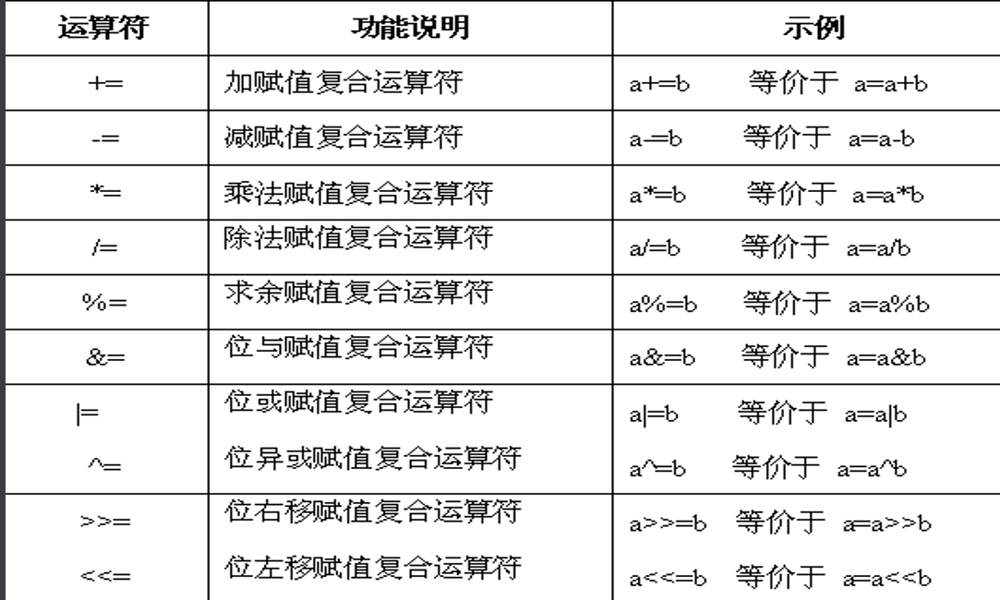

---

---


### 条件运算符

if<表达式1>为真，则执行<表达式2>，else执行<表达式3>

注意：只有表达式1是布尔型的判断

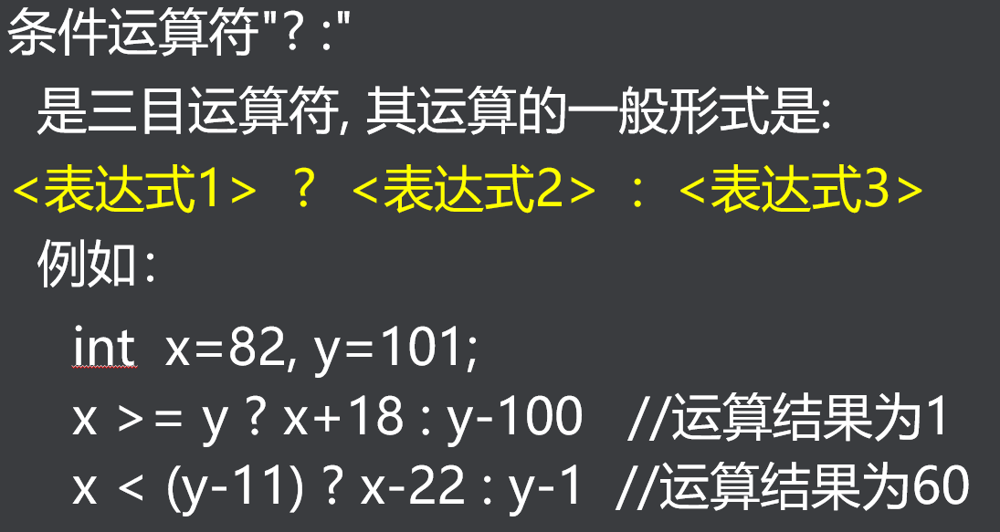

### 逗号运算符

在括号内的表达式从左往右依次执行，将最右边的结果赋值给最左边的变量


### ==内存运算符号==

```c
int a = 0;
int b = 0;
int c = 0;
b = sizeof(int);//括号内填变量和数据类型，都等同数据类型
c = sizeof(a);//b=c,内存占用的大小和变量的值无关，只和数据类型有关

```

### 运算符的==优先级==

记不住的，用到再来查

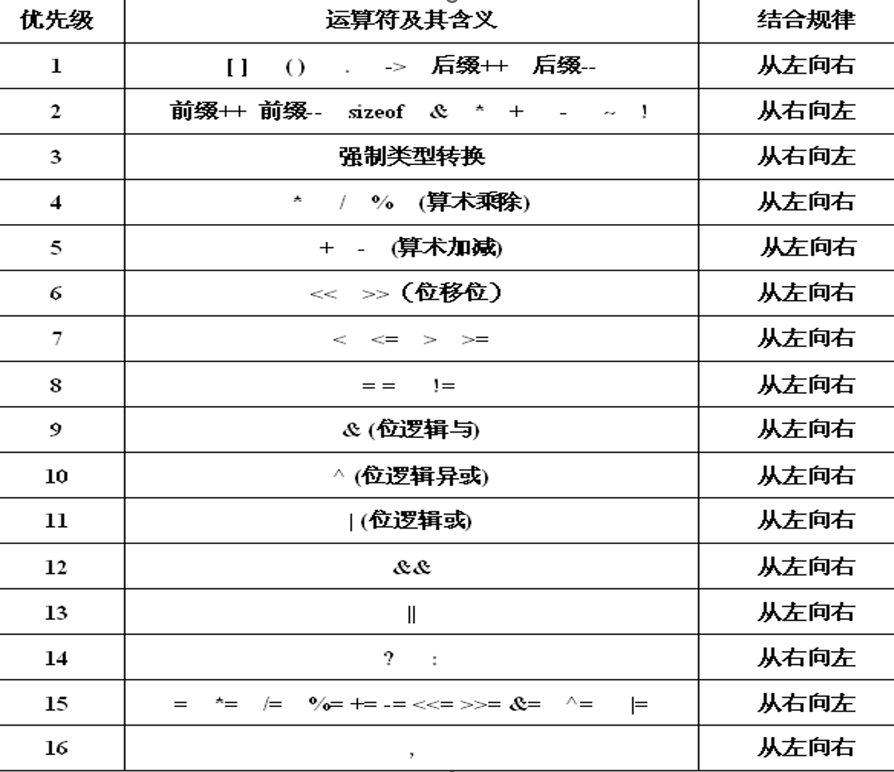

## 03输入和输出函数

来自<stdio.h>的输入输出函数

---

常量、变量、表达式从本质上都可以归纳为数据

在理解代码框架的过程中只需要关注数据的结果

得到结果的过程可以战略性忽略

### 格式输出函数：

printf(" 被打印的变量是：%格式符1，%格式符2 "，变量名1，变量名2)

不同数据类型的变量打印需要不同的格式符


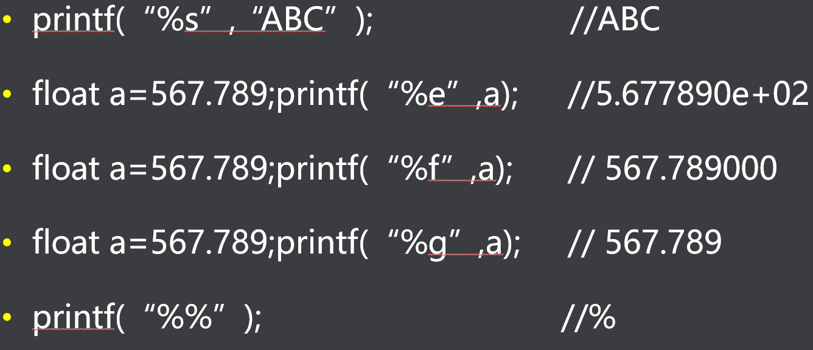

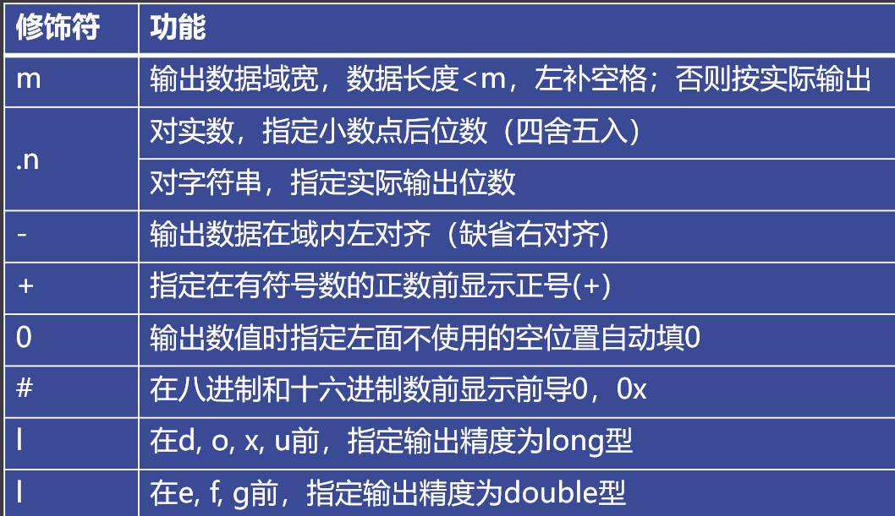

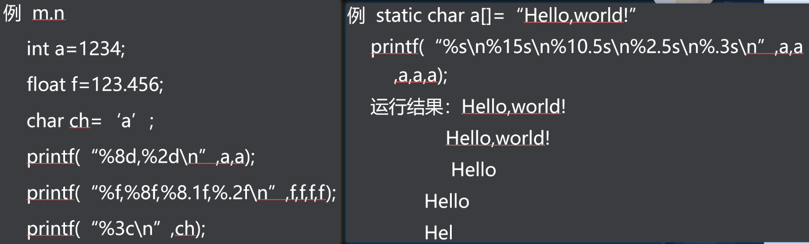


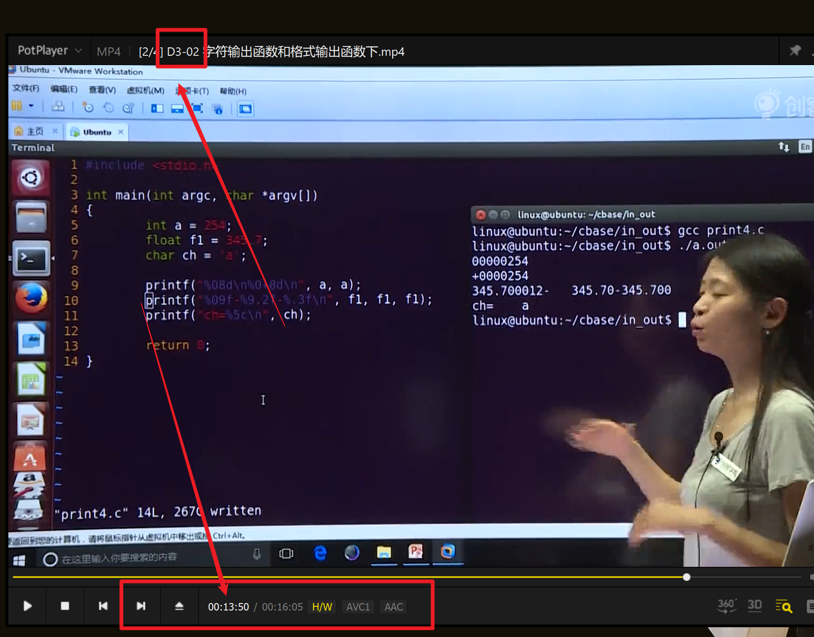


# day10 软件包管理及shell

```shell
打开终端Terminal快捷键   

Ctrl+Alt+t
```

Linux大概的体系结构

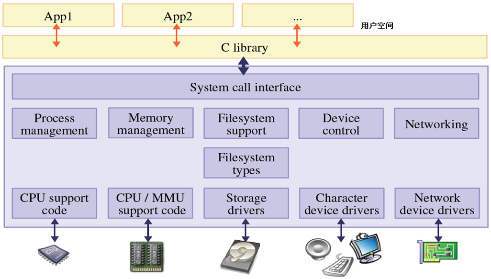


## 软件包

### 软件包的类型

- **Binary Packages**（二进制软件包）：它包含可执行文件、==库文件==、配置文件、man/info页面、版权声明和其它文档。

- **Source Packages**（源码包）：包含软件源代码、版本修改说明、构建指令以及==编译工具==等。==先由tar工具归档为.tar.gz文件，然后再打包成.dsc文件==。

```shell
软件包类型的查询命令 file

kidea@Linux:~$ file  g++_4.1.2-9ubuntu2_i386.deb
g++_4.1.2-9ubuntu2_i386: Debian binary package (format 2.0)
```

### 软件包命名规范

```she
Filename_Version-Reversion_Architecture.deb
软件包名称_软件版本-修订版本_系统内核架构.deb


```

### 软件源

>  根据软件包的开发组织对该软件的支持程度，以及遵从的开源程度，划分为如下四类：

- **核心（Main）**：官方维护的开源软件，是由Ubuntu官方完全支持的软件，包括大多数流行的、稳定的开源软件，是Ubuntu默认安装的基本软件包；

- **公共（Universe）**：社区维护的开源软件，是由Ubuntu社区的计算机爱好者维护的软件。这些软件包没有安全升级的保障。用户在使用时，需要考虑这些软件包存在的不稳定性；

- **受限（Restricted）**：官方维护的非开源软件，是专供特殊用途，而且没有自由软件版权，不能直接修改软件，但依然被Ubuntu团队支持的软件；

- **多元化（Multiverse）**：非Ubuntu官方维护的非开源软件，用户使用这些软件包时，需要特别注意版权问题。

### dpkg软件包管理器

> 所有源自“Debian”的“Linux”发行版都使用dpkg，例如Ubuntu、Knoppix等。

1. **功能**：dpkg主要用于==本地软件包==的管理。它侧重于安装、卸载和提供.deb软件包相关的信息。

2. 常用命令

   - 安装本地存在的软件：`dpkg -i <package_name>.deb`

   - 列出已安装的包列表：`dpkg -l`

   - 查看包的安装路径：`dpkg -L <package_name>`

   - 查看包是否安装：`dpkg -s <package_name>` 或 `dpkg --status <package_name>`

   - 查找指定文件所属的包名：`dpkg -S <file_name>` 或 `dpkg --search <file_name>`

   - `dpkg -r <package> ` 移除一个已经安装的软件包

   - `dpkg -P <package>`  移除已安装软件包及配置文件

     

### 软件包管理工具APT

> ATP软件包管理器的作用
>
> - **检查和修复软件包依赖关系**
> - **利用Internet网络帮助用户主动获取软件包**

> apt是基于dpkg的软件包管理工具，可以理解为dpkg的“前端”或“升级版”。apt不仅提供了与dpkg类似的软件包管理功能，还增加了远程包的下载和依赖管理。

1. **功能**：apt会解决和安装模块的依赖问题，并会咨询软件仓库。它侧重于远程包的下载和依赖管理，使得用户可以更方便地安装、更新和卸载软件包。
2. ==常用命令：==
   - 更新包信息：`sudo apt update`
   - 升级包：`sudo apt upgrade`
   - 安装包：`sudo apt install <package_name>`
   - 删除不再需要的依赖包：`sudo apt autoremove`

> 
>
> Ubuntu的软件源配置文件路径为`/etc/apt/sources.list` 

- 软件源配置文件只是告知Ubuntu系统可以访问的==镜像站点(服务器)地址==。

- 镜像站点没有软件资源的列表。
- APT为这些软件资源建立了索引文件，以便本地主机查询。

- 修改==sources.list==内的镜像源换为国内源可以提高访问速度

#### apt-get包更新命令：

使用`apt-get update`命令会扫描每一个软件源服务器，并为该服务器所具有软件包资源建立索引文件，存放在本地的/var/lib/apt/lists/目录中

#### apt-get命令格式：

```shell
apt-get  subcommands  [ -d | -f | -m | -q | --purge | --reinstall | - b | - s | - y | - u | - h | -v ]  pkg
```

| subcommands(子命令) | 描述                                   |
| ------------------- | -------------------------------------- |
| **update**          | 下载更新软件包列表信息                 |
| **upgrade**         | 将系统中所有软件包升级到最新的版本     |
| **install**         | 下载所需软件包并进行安装配置           |
| **remove**          | 卸载软件包                             |
| **autoremove**      | 将不满足依赖关系的软件包自动卸载       |
| **source**          | 下载源码包                             |
| **build-dep**       | 为源码包构建所需的编译环境             |
| **dist-upgrade**    | 发布版升级                             |
| **dselect-upgrade** | 根据dselect的选择来进行软件包升级      |
| **clean**           | ==删除缓存区中所有已下载的包文件==     |
| **autoclean**       | 删除缓存区中==老版本==的已下载的包文件 |
| **check**           | ==检查==系统中==依赖==关系的完整性     |

| 选项        | 描述                                              |
| ----------- | ------------------------------------------------- |
| -d          | 仅下载软件包，而不安装或解压                      |
| -f          | ==修复系统中存在的软件包依赖性问题==              |
| -m          | 当发现缺少关联软件包时，仍试图继续执行            |
| -q          | 将输出作为日志保留，不获取命令执行进度            |
| --purge     | ==与remove子命令一起使用，完全卸载软件包==        |
| --reinstall | ==与install子命令一起使用，重新安装软件包==       |
| -b          | 在下载完源码包后，编译生成相应的软件包            |
| -s          | 不做实际操作，只是模拟命令执行结果                |
| -y          | 对所有询问都作肯定的回答，apt-get不再进行任何提示 |
| -u          | 获取已升级的软件包列表                            |
| -h          | 获取帮助信息                                      |
| -v          | 获取apt-get版本号                                 |

#### apt-cache获取软件包详细信息

`apt-cache show`命令获取指定软件包的详细信息，包括软件包安装状态、优先级、适用架构、版本、存在依赖关系的软件包，以及功能描述。该命令可以同时显现多个软件包的详细信息。 

#### apt-cache 命令格式:

```shell
apt-cache  subcommands  [ -p | -s | - q | - i | - c | -h ]  pkg
```

| 子命令   | 描述                           |
| -------- | ------------------------------ |
| showpkg  | 获取二进制软件包的常规描述信息 |
| showsrc  | 获取源码包的详细描述信息       |
| show     | 获取二进制软件包的详细描述信息 |
| stats    | 获取软件源的基本统计信息       |
| search   | 根据正则表达式检索软件包       |
| depends  | 获取该软件包的依赖信息         |
| rdepends | 获取所有依赖于该软件包的软件包 |
| pkgnames | 列出所有已安装软件包的名字     |
| policy   | 获取软件包当前的安装状态       |

## Shell命令

**shell简介：**

- **命令**是用户向系统内核发出控制请求，与之交互的文本流。

- shell是一个命令行解释器，将用户命令解析为操作系统所能理解的指令，实现用户与操作系统的交互。

- 当需要重复执行若干命令，可以将这些命令集合起来，加入一定的控制语句，编辑成为**shell脚本**文件，交给shell批量执行。 

## 各种shell

**目前流行的shell主要有几种 :**

- **Bourne Shell**（简称**sh**）：它是Unix的第一个shell程序，早已成为工业标准。目前**几乎所有的Linux**系统都支持它。不过Bourne Shell的作业控制功能薄弱，且不支持别名与历史记录等功能。

- **C Shell**（简称**csh**）

- **KornShell**（简称**ksh**）

- **Bourne Again Shell**：能够提供环境变量以配置用户Shell环境，支持历史记录，内置算术功能，支持通配符表达式，将常用命令内置简化。

## bash shell的基本格式

```shell
username@hostname:direction$ Command [-Options] Argument1 Argument2 …

username：用户名，显示当前登录用户的账户名；
hostname：主机名，显示登录的主机名，例如若远程登录后，则显示登录的主机名；
direction：目录名，显示当前所处的路径，当在根目录下显示为“/”，当在用户主目录下显示为“~”；

$：       Shell提示符，如果当前用户为超级用户，提示符为“#”，其他用户的提示符均为“$”；

Command： 命令名称，Shell命令或程序，严格区分大小写
Options： 命令选项，用于改变命令执行动作的类型，由“-”引导，可以同时带有多个选项；
Argument：命令参数，指出命令作用的对象或目标，有的命令允许带多个参数。
```

- 一条命令的三要素之间用空格隔开；
- 若将多个命令在一行书写，用分号（;）将各命令隔开；
- 如果一条命令不能在一行写完，在行尾使用反斜杠（\）标明该条命令未结束。
- 命令不带选项或参数，意为使用默认选项或参数。

- 输入命令或文件名的前几个字符后，连续==按两下TAB键或ESC==键，用于==命令==补全；
- 按下==一次TAB键==，用于==文件名==补全。 
- 按上下键，可以切换命令的历史记录，默认保留500条命令。
- 使用命令**history** [numberline] 可以将命令历史记录按==列表显示==

## 关机与重启

```shell
立即关机
kidea@ubuntu:~$ sudo  shutdown  -h  now
立即重启
kidea@ubuntu :~$ sudo  shutdown  -r  now
立即重启
kidea@ubuntu :~$ sudo  reboot   now
定时45分钟关机
kidea@ubuntu:~$ sudo  shutdown  -h  +45   “That is all, game over.”
定时60分钟重启
kidea@ubuntu:~$ sudo  shutdown  -r  +60
```

## 查询shell的官方文档

```shell
如下，查询ls命令的帮助文档
man ls
```

## shell的通配符

**批量处理具有类似名称的文件**

| 通配符       | 含义                         | 实例                                                         |
| ------------ | ---------------------------- | ------------------------------------------------------------ |
| 星号 `*`     | 匹配任意长度的字符串         | 用`file_*.txt`，匹配file_wang.txt、file_Lee.txt、file3_Liu.txt |
| 问号 `?`     | 匹配一个长度的字符           | 用`flie_?.txt`，匹配file_1.txt、file1_2.txt、file_3.txt      |
| 方括号`[…]`  | 匹配其中指定的一个字符       | 用`file_[otr].txt`，匹配file_o.txt、file_r.txt和file_t.txt   |
| 方括号`[-]`  | 匹配指定的一个字符范围       | 用`file_[a-z].txt`，匹配file_a.txt、file_b.txt，直到file_z.txt |
| 方括号`[^…]` | 除了其中指定的字符，均可匹配 | 用`file_[^otr].txt`，除了file_o.txt、file_r.txt和file_t.txt的其他文件 |


```shell
示例操作：

kidea@ubuntu:~/mywork$ ls  file_*.txt
file_liu.txt   file_wang.txt   file_lee.txt   file_song.txt

kidea@ubuntu:~/mywork$ ls  file_?.txt
file_1.txt   file_2.txt   file_3.txt   file_4.txt   file_5.txt

kidea@ubuntu:~/mywork$ ls   file_[1-5].txt
file_1.txt   file_2.txt   file_3.txt   file_4.txt   file_5.txt

linuxx@ubuntu:~/mywork$ ls   file_[^245].txt
file_1.txt   file_3.txt
```

## shell的管道

**一次性执行一串命令 **即上一个命令的输出传递给下一个命令的输入，相当于通过使用“|”符连成了一个命令管道。

```shell
kidea@ubuntu:~$ ls  /usr/bin  | wc  –w
1249
```

例如上述操作中，借助管道“|”，将ls的输出直接作为wc命令的输入，得到的是/usr/bin目录下文件的个数为1249。

---

## 输入/输出重定向

- 输入/输出重定向是==改变==**shell命令或程序**默认的==标准输入/输出目标==，重新定向到新的目标文件。

- linux中默认的标准输入定义为==键盘==，标准输出定义为==终端==窗口。

- 用户可以为当前操作==重定向==输入或输出，迫使某个特定命令的输入或输出来源为==外部文件==。

| 重定向符 | 含义                               | 实例                                                         |
| -------- | ---------------------------------- | ------------------------------------------------------------ |
| >  file  | 将file文件重定向为输出源，新建模式 | ls  /usr > Lsoutput.txt，将ls /usr的执行结果，写到Lsoutput.txt文件中，若有同名文件将被删除 |
| >> file  | 将file文件重定向为输出源，追加模式 | ls  /usr >> Lsoutput.txt，将ls /usr的执行结果，追加到Lsoutput.txt文件已有内容后 |
| <  file  | 将file文件重定向为输入源           | wc  < file1，将file1中的内容作为输入传给wc命令               |
| 2>或&>   | 将由命令产生的错误信息输入到文件中 | ls  noexistingfile.txt 2> err.log，使用ls命令，查看一个不存在的文件时，将系统错误提示保存在err.log文件中 |

```shell
#cat命令 功能为:在标准输出上显示文件
kidea@ubuntu:~/mywork$ cat            #使用标准输入/出设备
have a good day!                #用户使用标准输入设备——键盘，键入字符串，并按Enter键
have a good day!                #系统在标准输出——显示器上，显示用户刚刚输入的字符串

kidea@ubuntu:~/mywork$ cat > file1.txt    #输出重定向，将输出定向到文件file1.txt
have a good day!               #用户使用标准输入设备——键盘，键入字符串，并按Enter键
                                              #用户输入的字符串被保存在file1.txt文件中
kidea@ubuntu:~/mywork$ cat < file1.txt    #输入重定向，将cat命令的输入指定为file1.txt文件
have a good day!                #系统在标准输出显示器上，显示cat命令从文件中读出的字符串
```

## 命令置换

- 命令替换是将一个命令的输出作为另一个命令的参数。

```shell
# 基本格式  command1  `command2`
#其中，命令command2的输出将作为命令command1的参数。
#需要注意，命令置换的单引号为ESC键下方的“`”键 

kidea@ubuntu:~$ ls  `pwd`
Desktop  Examples  historycommandlist  mywork

#pwd命令用于显示当前目录的绝对路径。
#在上面的命令行中，使用命令置换符，将pwd的运行结果作为ls命令的参数。
#最终，命令执行结果是显示当前目录的文件内容。
```

# day11 shell系统维护命令

## 系统维护基本命令

### 帮助文档-man

- 学习shell新命令最高效的方法是使用命令==man==获取帮助文档

```shell
kidea@ubuntu:~$ man commandname
#commandname是要查询的命令的名称，包括：名称、函数、语法以及可选参数描述等
#帮助页面使用PageUp和PageDown键翻页，使用“：q”退出帮助页面
```

```shell
#帮助页面的基本信息框架
NAME：命令的名称
SYNOPSIS：命令的语法格式
DESCRIPTION：命令的一般描述以及用途
OPTIONS：描述命令所有的参数或选项
SEE ALSO：列出帮助页面中与该命令直接相关或功能相近的其他命令
BUGS：解释命令或其输出中存在的任何已知的问题或缺陷
EXAMPLES：普通的用法示例
AUTHORS：帮助页面以及命令的作者
```

### 修改密码-passwd

- passwd命令，为已有账户重新修改用户密码

```shell
kidea@ubuntu:~$ passwd  username
#超级用户root可以修改所有其他用户的密码，而普通用户只能修改自己的用户密码
```

```shell
kidea@ubuntu:~$ passwd
Changing password for kidea      #修改当前用户密码
(current) UNIX password:        #用户输入旧密码
Enter new UNIX password:       #用户输入新密码
Retype new UNIX password:      #确认新密码
passwd：已成功更新密码
```

### 改变身份-su

- su命令用于临时改变用户身份

```shell
kidea@ubuntu:~$ su  [-c | -m - ]  username
#选项“-c”表示执行一个命令后就结束
#选项-m表示仍保留环境变量不变
#选项-表示转换用户身份时，同时使用该用户的环境。
#当需要放弃当前用户身份，可以使用exit命令切换回来
```

```shell
kidea@ubuntu:~$ su
#单独使用su命令，默认为要转换为超级用户root
Password:     #当前用户输入超级用户的密码
root@ubuntu:/home/linux#

```

标准输出-echo

- echo命令用于在标准输出——显示器上显示一段文字，一般起到提示作用

```shell
kidea@ubuntu:~$ echo  [-n]  information
#选项-n表示输出文字后不换行。提示信息字符串information可以加引号，也可以不加。

```

```shell
kidea@ubuntu:~$ echo   "Hello kidea"    #输入信息字符串使用引号
Hello kidea
kidea@ubuntu:~$ echo   ‘$PATH’    #严格的原样输出
$PATH.
kidea@ubuntu:~$ echo    Hello kidea.         
Hello kidea.
#输入信息字符串不使用引号,字符串之间用一个空格隔开

kidea@ubuntu:~$ echo $PATh #打印环境变量
```

### 系统时间-date

- date命令用于显示和设置系统日期和时间

```shell
kidea@ubuntu:~$ date  [-d | -s|-u ]  datestr
#选项-s表示按照datestr日期显示格式设置日期
#单独使用date命令，用于显示系统时钟中当前日期

```

```shell
kidea@ubuntu:~$ date            #查看当前时间
2024年 09月 16日 星期日 18:44:45 CST
kidea@ubuntu:~$ sudo  date  -s  1:19:18   #设置新时间，需要系统管理员权限
Password:
2024年 09月 16日 星期日 01:19:18 CST
```

### 清除屏幕-clear

```shell
kidea@ubuntu:~$ clear
#清除终端的全部字符
```

### 磁盘空间-df

- df命令用于查看磁盘空间的使用情况。

```shell
kidea@ubuntu:~$ df  [-a | -T | -h | -k ]  Filesystem
#参数Filesystem表示物理文件系统
```

| 选项 | 含义                                                         |
| ---- | ------------------------------------------------------------ |
| -a   | 显示所有物理文件系统的使用情况，包括虚拟文件系统，如/proc、/sys等 |
| -T   | 显示物理文件系统的文件格式类型                               |
| -h   | 物理文件系统大小按兆字节为单位显示                           |
| -k   | 物理文件系统大小按千字节为单位显示                           |
| -l   | 仅列出本地文件系统                                           |

```shell
kidea@ubuntu:~$ df –T
文件系统      类型         1K-块     已用       可用     已用%     挂载点
/dev/sda1    ext3      7850996   2664868  4787316   36%    /
varrun       tmpfs     255960    104      255856     1%     /var/run
varlock      tmpfs     255960     0       255960     0%     /var/lock
procbususb   usbfs     255960     84      255876     1%     /proc/bus/usb
udev         tmpfs     255960     84      255876     1%     /dev
devshm       tmpfs     255960      0      255960     0%     /dev/shm
lrm          tmpfs     255960    33788    222172     14%     /lib/modules/2.6.20-16-generic/volatile
/dev/hdc    iso9660   712946   712946          0    100%    /media/cdrom0
/dev/sdb1     vfat    249582    211602     37980     85%     /media/disk
#这台计算机只有一块硬盘（/dev/sda1），文件格式类型为Ext3，已经使用36%的存储空间。同时，可以发现计算机上还安装了CD-ROM（/dev/hdc）、USB存储器（/dev/sdb1）。其他分区均为专用的虚拟文件系统
```

## 用户管理命令

### 用户的基本属性

- 用户名

- 密码

- 用户ID（**UID**）

- 用户主目录（**HOME**）

- 用户**shell**

### /etc/passwd所有用户文件

```shell
kidea@ubuntu:~$ vim /etc/passwd
```

> 是系统能够识别的用户清单。用户登陆时，系统查询这个文件，确定用户的UID并验证用户口令

- 登陆名

- 经过加密的密码

- UID

- 默认的组ID （GID）

- 个人信息

- 主目录

- 登陆shell

### /etc/group组用户文件

> 包含了UNIX组的名称和每个组中成员列表，每一行代表一个组，包括4个字段：

- 组名

- 加密的密码

- GID号

- 成员列表，彼此用逗号隔开

### 添加用户-adduser

```shell
kidea@ubuntu:~$ adduser username
#创建新用户后，需要输入用户的属性
```

### 用户配置 /etc/adduser.conf 

```shell
FIRST_UID=1000
LAST_UID=29999
USERS_GID=100
DHOME=/home
DSHELL=/bin/bash
SKEL=/etc/skel
```

### SKEL文件模板

- /etc/skel文件是被 /usr/sbin/useradd调用的

```shell
#新用户拥有的配置文件从/etc/skel目录拷贝，常用的文件： 
.bash_profile
.bashrc
.bash_logout
 dircolors
.inputrc
.vimrc  
```

### 添加用户步骤

**系统自动配置**

- 编辑passwd和shadow文件，定义用户帐号

- 设置一个初始口令

- 创建用户主目录，用chown和chmod命令改变主目录的属主和属性

**用户配置**

- 将默认的启动文件复制到用户主目录中

- 设置用户的邮件主目录并建立邮件别名

``` shell
#修改用户密码
kidea@ubuntu:~$ sudo passwd  [-k] [-l] [u] [-f] [-d] [-S]  username
```

```shell
#修改用户属性
kidea@ubuntu:~$ usermod [-u uid [-o]] [-g group] [-G gropup,…]
						[-d home [-m]] [-s shell] [-c comment]
						[-l new_name] [-f inactive][-e expire]
						[-p passwd] [-L|-U] name
#用户oldname改名为newname，注意要同时更改家目录： 
kidea@ubuntu:~$ sudo usermod  –d  /home/newname  –m    –l  newname  oldname

```

```shell
#删除用户
kidea@ubuntu:~$ deluser  <username>
#举例删除用户xiaoming的同时删除用户的工作目录 
kidea@ubuntu:~$ deluser  --remove-home  xiaoming
```

```shell
#添加用户组
kidea@ubuntu:~$ addgroup  groupname
#删除用户组
kidea@ubuntu:~$ delgroup  groupname
```

## 进程管理命令

```shell
#显示进程 (process) 的动态
kidea@ubuntu:~$ ps [-options]
                    -A 列出所有的行程 
                    -w 显示加宽可以显示较多的资讯 
                    -au 显示较详细的资讯 
                    -aux 显示所有包含其他使用者的行程 
```

```shell
#进程状态的一些标识符
D:  	不可中断的静止        
R:  	正在执行中 
S:  	阻塞状态 
T:  	暂停执行 
Z:  	不存在但暂时无法消除 
<:  	高优先级的进程 
N:  	低优先级的进程 
L:  	有内存分页分配并锁在内存中
```

```shell
#实时监视所有进程的CPU和内存等资源占用的情况
kidea@ubuntu:~$ top
#按q退出
```

```shell
#将所有行程以树状图显示
kidea@ubuntu:~$ pstree  -option
                        -a 显示该进程的完整指令及参数, 如果是被内存置换出去的进程则会加上括号
                        -c 如果有重覆的进程名, 则分开列出
```

```shell
#kill命令向指定的进程发出一个信号signal序号，在默认的情况下，kill命令向指定进程发出信号序号15，正常情况下，将杀死那些不捕捉或不忽略这个信号的进程
kidea@ubuntu:~$ kill -signal PID 
```

## linux文件系统

> 文件系统
>
> - 用于组织和管理计算机存储设备上的大量文件
> - 并提供用户交互接口

Linux的文件系统管理工具：

- Nautilus图形文件管理器

- shell文件系统管理工具

### 文件系统格式

> **磁盘文件系统**：指本地主机中实际可以访问到的文件系统，包括硬盘、CD-ROM、DVD、USB存储器、磁盘阵列等。常见文件系统格式有：autofs、coda、Ext（Extended File sytem，扩展文件系统）、Ext3、Ext4、VFAT、ISO9660（通常是CD-ROM）、UFS（Unix File System，Unix文件系统）、FAT、FAT16、FAT32、NTFS等；

> **网络文件系统**：是可以远程访问的文件系统，这种文件系统在服务器端仍是本地的磁盘文件系统，客户机通过网络远程访问数据。常见文件系统格式有：NFS、Samba等

> **专有/虚拟文件系统**：不驻留在磁盘上的文件系统。常见格式有：TMPFS（临时文件系统）、PROCFS（Process File System，进程文件系统）和LOOPBACKFS（Loopback File System，回送文件系统）

> 目前**Ext4**是Linux系统广泛使用的一种文件格式。在Ext3基础上，对有效性保护、数据完整性、数据访问速度、向下兼容性等方面做了改进。
>
> 最大特点是日志文件系统：可将整个磁盘的写入动作完整地记录在磁盘的某个区域上，以便在必要时回溯追踪。

### 硬盘分区

```shell
kidea@ubuntu:~$ cd /dev/
#所有设备的文件在这个文件夹下/dev/
#SCSI或sata硬盘的设备名称/dev/sda1 其中 sd表示sata硬盘 a表示硬盘序号 1表示该硬盘分区的序号
# IDE硬盘的设备名称/dev/hdc2 其中 hd表示 IDE硬盘 c表示硬盘序号 2表示该硬盘分区的序号
```

```shell
#查看硬盘的详细信息
kidea@ubuntu:~$ cat /proc/partitions
```

### 交换分区

> 将内存中的内容写入硬盘或从硬盘中读出，称为**内存交换（swapping）**

- 交换分区必须大于等于计算机的内存

- 可以创建多个的交换分区

- 尽量把交换分区放在硬盘驱动器的==起始位置==

### 文件系统结构

> **在Windows下，目录结构属于分区；在Linux下，分区属于目录结构。**
>
> 说人话大概是windows可以有很多根目录，而Linux只有一个根目录

> - 在Linux中，将==所有硬件都视为文件==来处理，包括硬盘分区、CD-ROM、软驱以及其他USB移动设备等。
> - 为了能够按照统一的方式和方法访问文件资源，Linux中提供了对每种硬件设备相应的设备文件。
> - 一旦Linux系统可以访问到硬件，就将其上的文件系统==挂载==到目录树中的一个子目录中。
>
> - 例如，用户插入U盘，Linux自动识别后，将其==挂载==到`/media/disk`目录下。
> - 而Windows系统则将U盘作为新驱动器，表示为 `F: 盘`。

#### Linux的文件 tree

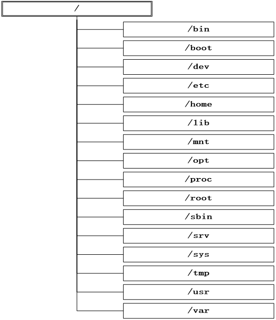

####  **FHS，File Hierarchy Standard**（文件层次结构标准）

>
> 2004年发行版本FHS 2.3。所有Linux系统都遵循这个标准来规范**文件目录命名和存放标准**
>
> Ubuntu Linux系统同样也遵循这个标准。 

| **目录名**      | **描述**                                                     |
| --------------- | ------------------------------------------------------------ |
| **/**           | Linux文件系统**根目录**                                      |
| **/bin**        | 存放系统中最常用的**可执行文件**（二进制文件）               |
| **/boot**       | 存放**Linux内核**和**系统启动**文件，包括Grub、lilo启动器程序 |
| **/dev**        | 存放**所有设备文件**，包括硬盘、分区、键盘、鼠标、USB、tty等 |
| **/etc**        | 存放系统的**所有配置文件**，例如==passwd==存放用户账户信息，hostname存放主机名等 |
| **/home**       | ==用户主目录==的默认位置                                     |
| **/initrd**     | 存放启动时挂载**initrd.img** 镜像文件的目录，以及载入所需**设备模块**的目录。 |
| **/lib**        | 存放**共享的库文件**，包含许多==被**/bin和/sbin**中程序使用的库文件== |
| **/lost+found** | 存放由fsck放置的零散文件                                     |
| **/media**      | Ubuntu系统自动挂载CD-ROM、软驱、USB存储器后，存放**临时读入的文件** |
| **/mnt**        | 该目录通常用于作为**被挂载**的文件系统的**挂载点**           |
| **/opt**        | 主要被**第三方开发者**用来简易地安装和卸装他们的**软件包**作为可选文件和程序的存放目录 |
| **/proc**       | 存放所有标志为文件的**进程**，它们是通过**进程号**或其他的系统动态信息进行标识，例如cpuinfo文件存放CPU当前工作状态的数据 |
| **/root**       | **root用户**的主目录                                         |
| **/sbin**       | 存放更多的**可执行文件**（二进制文件），包括系统管理、目录查询等关键命令文件 |
| **/srv**        | 服务目录，存放**本地服务**的相关文件                         |
| **/sys**        | 系统目录，存放**系统硬件信息**的相关目录                     |
| **/tmp**        | 存放用户和程序的==临时文件==，**所有用户对该目录都有读写权限  ** |

| **/usr**         | 用于存放与系统用户直接有关的文件和目录，例如应用程序及支持它们的库文件。以下罗列了/usr中部分重要的目录。 |
| ---------------- | ------------------------------------------------------------ |
| /usr/X11R6：     | X  Window系统                                                |
| /usr/bin         | 用户和管理员的标准命令                                       |
| /usr/include     | c/c++等各种开发语言环境的标准include文件                     |
| /usr/lib         | 应用程序及程序包的连接库                                     |
| /usr/local       | 系统管理员安装的应用程序目录                                 |
| /usr/local/share | 系统管理员安装的共享文件                                     |
| /usr/sbin        | 用户和管理员的标准命令                                       |
| /usr/share       | 存放使用手册等共享文件的目录                                 |
| /usr/share/dict  | 存放词表的目录                                               |
| /usr/share/man   | 系统使用手册                                                 |
| /usr/share/misc  | 一般数据                                                     |
| /usr/share/sgml  | SGML数据                                                     |
| /usr/share/xml   | XML数据                                                      |
| **/var**         | 通常用于存放长度可变的文件，例如日志文件和打印机文件。以下罗列了/var其中部分重要的目录。 |
| /var/cache       | 应用程序缓存目录                                             |
| /var/crash       | 系统错误信息                                                 |
| /var/games       | 游戏数据                                                     |
| /var/lib         | 各种状态数据                                                 |
| /var/lock        | 文件锁定纪录                                                 |
| /var/log         | 日志记录                                                     |
| /var/mail        | 电子邮件                                                     |
| /var/opt         | /opt目录的变量数据                                           |
| /var/run         | 进程的标示数据                                               |
| /var/spool       | 存放电子邮件，打印任务等的队列目录。                         |
| /var/tmp         | 临时文件目录                                                 |

#### 文件路径

**绝对路径**：指文件在文件系统中完整的准确位置。以==根目录为起点==，以目标文件或目录为终点。

>  例如“/usr/games/gnect”就是绝对路径

**相对路径**：指**相对**于用户**当前位置**的一个文件或目录的位置。

>  例如，用户处在usr目录中时，只需要“games/gnect”就可确定这个文件

#### 比较linux和windows

|                      | **Linux文件系统**                                            | **Windows文件系统**                                          |
| -------------------- | ------------------------------------------------------------ | ------------------------------------------------------------ |
| **文件格式**         | 使用的主要文件格式有：EXT2、EXT3、 RerserFS、ISO9660、vfat等 | 使用的主要文件格式有：FAT16、  FAT32、NTFS等                 |
| **存储结构**         | 逻辑结构犹如一颗倒置的树。将每个硬件设备视为一个文件，置于树形的文件系统层次结构中。因此，Linux系统的某一个文件就可能占有一块硬盘，甚至是远端设备，用户访问时非常自然 | 逻辑结构犹如多颗树（森林）。将硬盘划分为若个分区，与存储设备一起（例如CD-ROM、USB存储器等），使用驱动器盘符标识，例如A：代表软驱、C：代表硬盘中的第一个分区等。 |
| **与硬盘分区的关系** | 分区在目录结构中                                             | 目录结构在分区中                                             |
| **文件命名**         | Linux文件系统中严格区分大小写，MyFile.txt与myfile.txt指不同的文件。区分文件类型不依赖于文件后缀，可以使用程序file命令判断文件类型。 | windows文件系统中不区分大小写，MyFile.txt与myfile.txt是指同一个文件。使用文件后缀来标识文件类型。例如使用“.txt”表示文本文件。 |
| **路径分隔符**       | Linux使用斜杠“/”分隔目录名，例如“/home/usr/share”，其中第一个斜杠是根目录（/），绝对路径都是以根目录作为起点 | Windows使用反斜杠“\”分隔目录名，例如“C:\program \username”，绝对路径都是以驱动器盘符作为起点 |
| **文件与目录权限**   | Linux最初的定位是多用户的操作系统，因而有完善文件授权机制，所有的文件和目录都有相应的访问权限 | Windows最初的定位是单用户的操作系统，内建系统时没有文件权限的概念，后期的Windows逐渐增加了这方面的功能 |

---


## 文件系统的相关命令

```shell
#复习一些在c语言基础课中用到的命令
kidea@ubuntu:~$ pwd #查看当前所处的文件夹的绝对路径
kidea@ubuntu:~$ ls  #查看当前文件夹的列表文件或文件夹
kidea@ubuntu:~$ cd  #移动到目标文件夹
kidea@ubuntu:~$ touch   #新建文件
kidea@ubuntu:~$ cp   #复制文件
kidea@ubuntu:~$ mv   #移动文件
kidea@ubuntu:~$ rm   #删除文件
kidea@ubuntu:~$ cat  
kidea@ubuntu:~$ head
kidea@ubuntu:~$ tail
kidea@ubuntu:~$ mkdir   #新建文件夹
kidea@ubuntu:~$ rmdir   #删除文件夹
```


---

