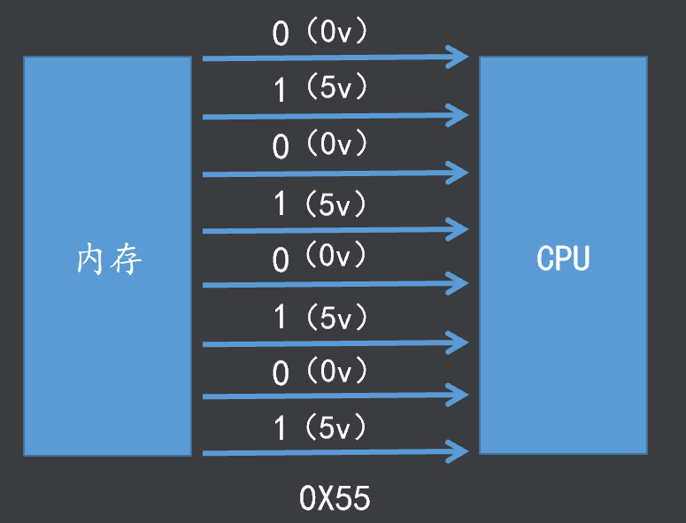
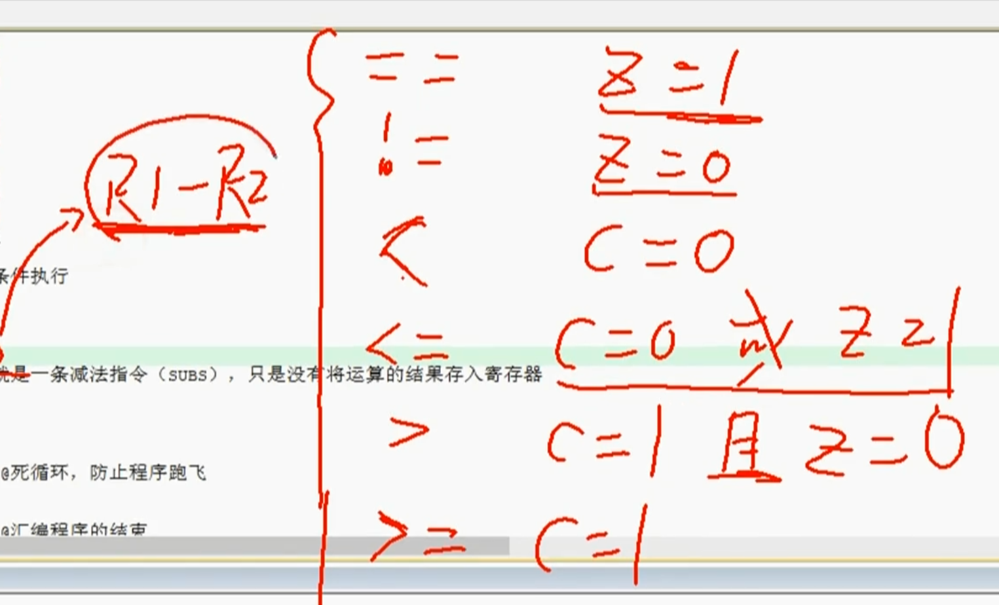
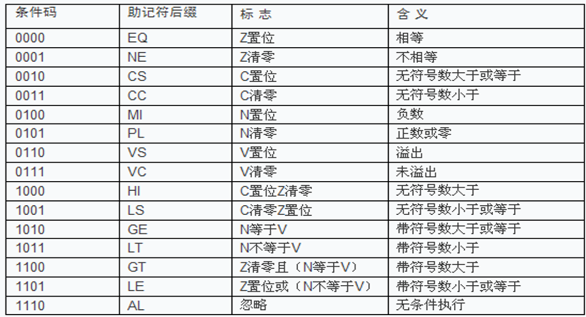

##  ARM裸机开发

- 华清远见-Linux-武老师

- ARM CPU**软件仿真**平台：**MDK 4.54**

- 使用外置的**gcc交叉编译工具链**      **arm-none-linux-gnueabi-**

  

---


**Linux方向课程结构**


- 目前课程处于底层开发的第一阶段，**ARM**裸机开发
- 学习过程中不要过多深入到其他课程
- 学习方法

# day01 计算机硬件基础


## Linux的结构框架


**Linux子系统**

  1.进程管理：管理进程的创建、调度、销毁等

  2.内存管理：管理内存的申请、释放、映射等

  3.文件系统：管理和访问磁盘中的文件

  4.设备管理：硬件设备及驱动的管理（==本次课程的重点==）

  5.网络协议：通过网络协议栈(TCP、IP...)进行通信

## 计算器基础知识



- 具体的二进制信号的电平由**通信协议**或**电平规范**确定

## 冯诺依曼-计算机架构


**输入设备**

-  把其他信号转换成计算机能识别和处理的信号并送入计算机中 如键盘、鼠标、摄像头等

 **输出设备**

-  把运算结果以人或其他设备所能接受的形式送出计算机外  如显示器、音响、打印机等

**存储器**

-  存储器是用来存储程序和数据的部件,是实现"存储程序控制"的基础如内存、硬盘等

**运算器**

-  CPU中负责进行算数运算和逻辑运算的部件，其核心是算术逻辑单元ALU

**控制器**

-  控制器是CPU的指挥中心,其控制着整个CPU执行程序的逻辑过程

> 注：运算器和控制器共同组成了CPU

## 总线


**总线**

- 总线是计算机中各个部件之间传送信息的公共通信干线,
- 在物理上就是一束导线按照其传递信息的类型可以分为==数据总线、地址总线、控制总线==

**DMA总线**

- DMA(Direct Memory Access)即直接存储器访问
- 使用DMA总线可以==不通过CPU==直接在存储器之间进行数据传递

---


## 三级存储结构

- 实际**计算机存储器**比较复杂一般是==**三级存储器**==（普通单片机一般只有一个存储器）

- 使用三级存储结构是为了兼顾**速度、容量、价格**
- **CPU不能直接读写硬盘**


**Cache**（高速缓存）

- ==速度最快==、价格最贵、容量最小、断电数据==丢失==、cpu可直接访问

-  存储当前正在执行的程序中的活跃部分,以便快速地向CPU提供指令和数据

**主存储器**

- 速度、价格、容量介于Cache与辅存之间、断电数据==丢失==、cpu可直接访问

-  存储当前正在执行的程序和数据

- 相当于==内存==，可以一次读写==1Byte==，但是内存容量较小

**辅助存储器**

- 速度最慢、价格最低、容量最大、断电数据==不丢失==、cpu不可直接访问

- 存储暂时不运行的程序和数据，需要时再传送到主存

- 相当于==硬盘==，硬盘属于**块设备**，例如：可能一次只能读写512KB，具体设备存在差异

## 地址空间


**地址空间**

-  一个处理器能够**访问**（读写）的存储空间是有限的,我们称这个空间为它的地址空间（**寻址空间**）

- 一般来说N位（bit）地址总线的处理器的地址空间是2的N次方

  - 一条总线只能读写 1bit 数据

  - **32位**系统地址空间为 2^32bit=**4GB**

  - 64位系统地址空间理论上为 2^64bit=16EiB

  - 实际上Linux 64位系统通常只使用低48位来描述虚拟内存空间，这意味着寻址范围为2^48，即256TB。

## CPU工作原理

- 一个**CPU核**一次只能执行一条指令
- 每执行一条指令后**PC**的值会**自动增加**指向下一条指令


**一条指令的执行分为三个阶段**

  **1.取址：** **PC**发送地址给内存，内存返回地址中的指令，**IR**接收指令的过程称为取址

  **2.译码：** 指令译码器对 **IR** 中的指令进行识别，将 **指令（机器码）**解析成具体的运算

  **3.执行：**控制器控制运算器中对应的**运算单元**进行运算，运算结果写入寄存器

---


# day02 ARM处理器概论

---


## ARM简介

ARM（Advanced RISC Machines)

- 一家公司的名称
- 一种CPU的架构
- 一种技术的名称

### **ARM公司**

- 成立于1990年11月，前身为Acorn计算机公司

- 主要设计ARM系列RISC处理器内核

- 授权ARM内核给生产和销售半导体的合作伙伴，ARM公司并不生产芯片

- 提供基于ARM架构的开发设计技术软件工具、评估板、调试工具、应用软件、总线架构、外围设备单元等

### ARM架构

基于ARM架构定义指令集和==编程模型==（基本数据类型、工作模型、寄存器组）

### SOC(System on Chip)

- 即片上系统，将一个系统中所需要的全部部件集成在一个芯片中在体积、功耗、价格上有很大优势
- CPU是SOC的核心


### ARM架构的版本

   V1-V3 最早的版本，目前已废弃

   V4-V6 经典处理器中运用的比较多

   V7 目前Cortex系列处理器主要是这种架构、支持Thumb-2的32位指令集（Cortex-M4就是这个版本）

   V8 兼容ARMv7架构的特性，并支持64位数据处理

### ARM的三个系列

##### Cortex-M 

为单片机驱动的系统提供的低成本优化方案，应用于传统

的微控制器市场，智能传感器，汽车周边部件等。

##### Cortex-A 

针对开放式操作系统的高性能处理器；

应用于智能手机，数字电视，服务器等高端运用。 

##### Cortex-R 

针对实时系统、满足实时性、高可靠性控制需求；

应于汽车制动系统，动力系统，移动通信基带控制器等。

---


## 指令集

###### 概念

- ==**CPU**==能够识别并执行的**指令集合**；

- 一个指令对应一个物理上的**运算电路**

- 每一条指令可处理一个简单或复杂操作（加、乘、积分…）；

- 指令在**内存**中以机器码（**二进制**）的方式存在

- 每一条指令对应一条**汇编指令**

- 指令是对硬件电路的抽象

- 程序是指令的有序集合

###### 分类

- **精简指令集（RISC）：**
  - 指令简单而有效，格式和长度通常是固定的，大多数指令在一个周期内可以执行完毕，（ARM内核基于RISC）
  - 只保留常用的的简单指令，硬件结构简单，复杂操作一般通过简单指令的组合实现，一般指令长度固定，且多为单周期指令
  -  RISC处理器在功耗、体积、价格等方面有很大优势，所以在嵌入式移动终端领域应用极为广泛
- **复杂指令集（CISC）**
  - 包含处理复杂操作的特定指令，指令长度不固定，执行需要多个周期。（X86架构）
  - 不仅包含了常用指令，还包含了很多不常用的特殊指令，硬件结构复杂，指令条数较多，一般指令长度和周期都不固定
  -   CISC处理器在性能上有很大优势，多用于PC及服务器等领域

### **ARM处理器都支持两种指令集：**

- **ARM指令集**（==课程重点==）

  - 所有指令（机器码）都占用**32bit**存储空间

  - 代码灵活度高、简化了解码复杂度

  - 执行ARM指令集时PC值每次自增4

- **Thumb指令集**

  -  所有指令（机器码）都占用**16bit**存储空间

  - 代码密度高、节省存储空间

  - 执行Thumb指令集时PC值每次自增2

## **编译原理**


- 机器码（二进制）是处理器能直接识别的语言
  - 不同的机器码代表不同的运算指令
  - 处理器能够识别哪些机器码是由处理器的硬件设计所决定的
  - 不同的处理器机器码不同，所以机器码不可移植

- 汇编语言是机器码的符号化
  - 即汇编就是用一个符号来代替一条机器码
  - 所以不同的处理器汇编也不一样，即汇编语言也不可移植

- C语言在编译时我们可以使用不同的编译器将C源码编译成不同架构处理器的汇编，所以C语言可以移植

## ARM存储模型

**ARM采用32位架构，基本数据类型只有三种**

> 因为总线是32bit，所以一次只能处理23bit的数据

### 基本数据类型

- **Byte               8bits  = 1byte**

- **Halfword     16bits = 2byte**  （半字）

- **Word            32bits = 4byte**     （字）

### **数据存储**

- 内存中一个地址代表==1byte==
- ==**规定：**==数据本身是多少位在内存存储时就应该多少位==对齐==

- **Halfword**型数据在内存的**起始地址**==必须==是（十进制）**2**的**整数倍**
- **Word**型数据在内存的**起始地址**==必须==是（十进制）**4**的**整数倍**


> 用16进制表示内存地址时，一个单位长度等于4bit，每进一位增加4bit，即**每进2位增加一个字节**

### 字节序

> 在Linux网络编程课程中有详细讲解
>
> 只占用一个字节的数据没有字节序

**大端对齐**

- 低地址存放高位，高地址存放低位

```c
a = 0x 1234 5678 ;
1234是高位  5678是低位
序号小的地址称为低地址，一般从上往下地址依次变高
```

**小端对齐**

-  低地址存放低位，高地址存放高位
- ==ARM一般使用小端对齐==（路由器之类是大端对齐）

 ```c
 a = 0x 1234 5678 ;
 Ubuntu是小端对齐，即取a的地址读到的是78
 ```


### 指令存储

**处理器处于ARM指令状态时**

- 指令长度是32bit

-  所有指令在内存的起始地址必须是（十进制）4的整数倍

-  PC值由其[31:2]位决定，[1:0]位未定义，即PC只看前面的高30位地址，后面的低2位地址会强制为00
- 因为合法地址一定是（十进制）4的整数倍，而4的整数倍转换为二进制后低2位都是00
- 给PC输入非法地址时候，CPU会把低2位地址会强制置为00

**处理器处于Thumb指令状态时**

- 指令长度是16bit

- 所有指令在内存的起始地址必须是（十进制）2的整数倍

- PC值由其[31:1]位决定，[0]位未定义
- 同理，给PC输入非法地址时候，CPU会把低1位地址会强制置为0

## ARM工作模式

**ARM-Cortex-A9 有8个基本的工作模式**

  

| 模式    | 说明                                                |
| ------- | --------------------------------------------------- |
| User    | 非特权模式，一般在执行上层的应用程序时ARM处于该模式 |
| FIQ     | 当一个高优先级中断产生后ARM将进入这种模式           |
| IRQ     | 当一个低优先级中断产生后ARM将进入这种模式           |
| SVC     | 当复位或执行==软中断==指令后ARM将进入这种模式       |
| Abort   | 当产生存取异常时ARM将进入这种模式                   |
| Undef   | 当执行未定义的指令时ARM将进入这种模式               |
| System  | 使用和User模式相同寄存器集的特权模式                |
| Monitor | 为了安全而扩展出的用于执行安全监控代码的模式        |

> 注意，操作系统的**内核态和用户态**不等于处理器的**工作模式**
>
> 不用背，中断后面会详细介绍

- 不同模式拥有不同**权限**

- 不同模式**执行**不同代码

- 不同模式完成不同的**功能**

### 工作模式分类

**按照权限**分类

- User为非特权模式（权限较低）

- 其余模式均为特权模式（权限较高）

 **按照状态**分类

- FIQ、IRQ、SVC、Abort、Undef属于异常模式
- 即当处理器遇到异常后会进入对应的模式

# day03 ARM寄存器组织

**概念：**这里是的寄存器是**CPU内部**的存储器，==没有地址==

**作用：**一般用于**暂时存**放参与运算的**数据**和运算**结果**

> C语言中的registe类型的变量就是存在CPU内部的寄存器，而不是内存
>
> 所以不用取址，CPU可以直接用

**分类**

- 通用寄存器
- 专用寄存器
- 控制寄存器


- 所谓工作模式的**权限**，就是可以用的寄存器不一样
- 在某个特定模式下只能使用当前模式下的寄存器
- 一个模式下特有的寄存器其他模式下不可使用


---


## 专用寄存器

**R15   (别称  PC  , Program Counter)**

- 程序计数器，用于存储当前取址**指令的地址**

- 默认情况下PC会自动增加4 bytes（下一条指令），也可以用汇编给PC赋值

**R14(  别称 LR ,  ink Register)**

  链接寄存器，一般有以下两种用途：

-  ==主动==执行跳转指令(BL/BLX)时，LR会**自动保存**跳转指令**下一条指令**的地址
  - 程序需要返回时将LR的值复制到PC即可实现

- ==被动==产生异常（中断）时，对应异常模式下的LR会**自动保存**被异常打断的指令的**下一条**指令的地址
  - 异常处理结束后将LR的值复制到PC可实现程序返

**R13(  SP  ,  Stack Pointer)**

  栈指针，用于存储当前模式下的栈顶地址

 局部变量、函数参数、函数返回值等一些临时数据存在**栈**里

栈的本质就是一段内存，而==SP==存放的就是栈的起始地址（**栈顶地址**）


## 控制寄存器

**CPSR**    (Current Program Status Register)，  **当前程序状态寄存器** 

- CPSR一共是32 bits，常用的是**低8位**、**高4位**


**Bit[4:0]**    低5位控制CPU的**工作模式**

  [10000]=User 

  [10001]=FIQ 

  [10010]=IRQ  

  [10011]=SVC

  [10111]=Abort 

  [11011]=Undef 

  [11111]=System 

  [10110]=Monitor

**Bit[5]**    第6位控制**指令集模式**

  [0]ARM状态   [1]Thumb状态

**Bit[6]**  第7位控制**高优先级中断**

  [0]开启FIQ   [1]禁止FIQ

**Bit[7]**   第8位控制**低优先级中断**

  [0]开启IRQ   [1]禁止IRQ

**Bit[28]** 

- 当运算器中进行加法运算且产生符号位进位时该位自动置1，否则为0
- 当运算器中进行减法运算且产生符号位借位时该位自动置0，否则为1

**Bit[29]** 

- 当运算器中进行加法运算且产生进位时该位自动置1，否则为0
- 当运算器中进行减法运算且产生借位时该位自动置0，否则为1

**Bit[30]** 

- 当运算器中产生了0的结果该位自动置1，否则为0

**Bit[31]** 

- 当运算器中产生了负数的结果该位自动置1，否则为0

---


# day04 ARM异常处理

## 异常的概念

处理器在正常执行程序的过程中可能会遇到一些不正常的事件发生，这时处理器就要将当前的程序暂停下来转而去处理这个异常的事件，异常事件处理完成之后再返回到被异常打断的点继续执行程序

> 本质上就是异常事件触发了程序的跳转，正常程序和异常程序都是提前写好的

## CPU的异常处理机制

​	不同的处理器对异常的处理的流程大体相似，但是不同的处理器在具体实现的机制上有所不同；比如处理器遇到哪些事件认为是异常事件遇到异常事件之后处理器有哪些动作、处理器如何跳转到异常处理程序如何处理异常、处理完异常之后又如何返回到被打断的程序继续执行等我们将这些细节的实现称为处理器的异常处理机制

## ARM异常源

### 概念

- 导致异常产生的事件称为异常源
- 触发异常的事件就是异常源

| ARM 异常源            |                                          |
| --------------------- | ---------------------------------------- |
| FIQ                   | 快速中断请求引脚有效（外部）             |
| IRQ                   | 外部中断请求引脚有效                     |
| Reset                 | 复位电平有效                             |
| Software Interrupt    | 执行swi指令（软件中断）                  |
| Data Abort            | 数据终止（cpu从内存读取不到数据）        |
| Prefetch Abort        | 指令预取终止（cpu从内存读取不到指令）    |
| Undefined Instruction | 遇到不能处理的指令（取到无法识别的指令） |

> ARM处理器只有这七个异常源（中断源）

### 异常向量表

- 异常向量表的本质是内存中的一段代码，**大小是 32Byte**
- 分为8个部分，每个部分 **4Byte**
- 如图下只有7个是对应7种中断源，Reserveed是保留的空间
- ARM的异常向量表的**基地址**默认在0x00地址，但可以通过配置**协处理器**来修改其地址
- 遇到异常后处理器自动将PC修改为对应的地址
- 每种中断源只有32bit，只能存放一条指令
- 所有我们不会直接在这里写异常处理程序，而是写一条跳转指令
- 跳转指令可以让程序跳转到指定的**异常处理程序的地址**


## ARM异常工作模式

> 7个异常源只有5个异常模式，中断源和中断模式不是一一对应

|                  | 快速中断 | 普通中断 | 复位&软中断 | 数据&指令中断               | 无法识别指令      |
| ---------------- | -------- | -------- | ----------- | --------------------------- | ----------------- |
| 异常源           | FIQ      | IRQ      | Reset & SWI | Data Abort & Prefetch Abort | Undef Instruction |
| 异常==工作模式== | FIQ      | IRQ      | **SVC**     | **Abort**                   | Undef             |
|                  |          |          |             |                             |                   |

## ARM中断响应

> CPSR当前程序状态：工作模式、指令集模式、中断优先级

- 中断响应本质上就是程序的**自动跳转**
- 每个异常工作模式都有专用的寄存器
- 例如:IRQ模式的专用寄存器`SPSR_irq`

### 中断的执行步骤：

- 程序正常执行中
- 某一类型中断源产生
- **拷贝CPSR寄存器**中的内容到对应**异常工作模式的专用寄存器**`SPSR_ModeName`
- 修改CPSR寄存器的值
  - 修改==中断禁止位==（高级bit[6]&低级bit[7]，置1表示禁止）
    - **同级别或低级的其他中断被禁止**
    - 如果进入低级中断**IRQ**过程中，出现高级中断源，会优先进入高级中断**FIQ**
    - **FIQ**执行完再回到**IRQ**
  - 修改==工作模式位==（低5位 bit[4:0]）
    - 修改为中断源触发的对应工作模式
  - 修改==ARM指令集==状态位
    - 处理中断只能处于ARM指令集状态
    - 处于Thumb状态会被强行切换到ARM状态
- **保存返回地址**到对应异常工作模式的**专用寄存器**`LR_ModeName`
  - 保存的是当前被打断的指令的**下一条指令的地址**
  - 处理完中断处理程序就可以返回原来的地址（写进PC寄存器）
- **设置PC**  为相应的异常向量（异常向量表对应的地址）
  - 程序跳转到==异常向量表==的地址（存放所有中断对应的地址的表）
  - 然后跳转异常向量表提供的对应的**跳转指令的地址**
  - 最后根据跳转指令跳转到**中断处理程序**的地址
  - 执行中断处理程序
- **中断的返回**
  - 把之前保存到`SPSR_ModeName`中的返回地址，写进CPSR
  - 恢复中断前的工作模式
  - 把之前保存到`LR_ModeName`中的返回地址，写进 PC
  - 继续执行中断前的下一条指令

## 异常优先级

**由高到底排序**

  **Reset**

  Data Abort

  **FIQ**

  **IRQ**

  Prefetch Abort

  Software Interrupt

  Undefined instruction

## FIQ和IRQ的区别

**FIQ**的响应速度比**IRQ**快的原因：

- FIQ在异常向量表位于最末，（写地址是从**低地址**往**高地址**写）
  - 所以FIQ可以直接把异常处理写在**异常向量表之后**，省去跳转的时间
  - 而位于**异常向量表中间**的异常就只能写**跳转指令**跳到更远的地方了
- FIQ模式比其他模式多5个**专用寄存器(R8-R12)**
  - 其他模式下的**(R8-R12)**寄存器是共用的
  - 例如：从正常的User模式，进IRQ中断模式后，需要**压栈**
  - 即把User模式下的**(R8-R12)**寄存器数据保存到栈区，然后**IRQ**才能使用**(R8-R12)**寄存器
  - 而FIQ的有自己的专用寄存器，所以不会影响到别的模式，不需要压栈
  - FIQ可直接处理中断
- FIQ的优先级高于IRQ
  - 两个中断同时发生时先响应FIQ
  - FIQ可以打断RIQ，但RIQ不能打断FIQ


## 指令流水线

- 指令CPU在一个周期内可以完成多个操作（前提是操作用到各部分电路互相独立）
- ARM7采用3级流水线


-   ARM9采用5级流水线

- Cortex-A9采用==8级流水线==

> 虽然流水线级数越来越多，但都是在**三级流水线**的基础上进行了细分

## PC寄存器的作用（重点）

==不管几级流水线==，PC指向的永远是当前**正在取指的指令**，而当前**正在执行**的指令的地址为**PC-8**

- 从流水线中可以可以看到，在同一周期内**当前**指令的**取址F**，和下一条指令的**执行E**是同时进行的

## 流水线的的优化

- 指令流水线机制的引入确实能够大大的提升指令执行的速度
- 但在实际执行程序的过程中很多情况下流水线时是无法形成的
- 比如芯片刚上电的前两个周期、执行跳转指令后的两个周期等
- 所以指令流水线的引入以及优化只能使平均指令周期不断的接近1，而不可能真正的达到1
- 且流水线级数越多芯片设计的复杂程度就越高，芯片的功耗就越高

## 多核处理器

**概念：**多核就是一个**SOC**中集成了多个**CPU内核**

**作用：**不同的**线程**可以运行在不同的核心中，做到真正的**并发**（同时执行）

**资源：**所有核**共用**外设与接口资源


---


# day05 ARM指令集仿真环境搭建


## 指令集

> 编译器将许多不同机器的汇编指令抽象成统一的标准接口（API）

**指令**

-  能够指示处理器执行某种运算的命令称为指令（如加、减、乘 ...）

- 指令在内存中以**机器码（二进制）**的方式存在

- 每一条指令都对应一条汇编

- 程序是指令的有序集合

**指令集**

- 处理器**能识别的指令**的集合称为**指令集**
-  不同**架构**的处理器指令集不同
- 指令集是**处理器**对开发者提供的**接口**

## 指令集的类型

### 1.数据处理指令：

- > 数学运算、逻辑运算

### 2.跳转指令：

- > 实现程序的跳转，本质就是修改了PC寄存器

### 3.Load/Srore指令：

- > 访问（读写）内存

### 4.状态寄存器传送指令：

- > 访问（读写）CPSR寄存器

### 5.软中断指令：

- > 触发软中断异常

### 6.协处理器指令：

- > 操控协处理器的指令

**汇编语言**

- 每条汇编都会唯一对应一条机器码，且CPU能直接识别和执行

- 即汇编中所有的指令都是CPU能够识别和执行的

- 汇编中寄存器的使用、栈的分配与使用、程序的调用、参数的传递等都需要自己维护

**C语言**

- 每条C语句都要被编译器编译成若干条汇编指令才能被CPU识别和执行

- 即C语句中的指令CPU不一定能直接识别，需要编译器进行“翻译”

- C中寄存器的使用、栈的分配与使用、程序的调用、参数的传递等都是编译器来分配和维护

## 学习汇编的作用

- 底层开发可能会读/写**小部分**汇编代码（驱动开发）

- 理解CPU是怎样执行程序的

- 理解C的本质，用汇编的思想写出高效的C代码

## 仿真器的类型

**硬件仿真**

  通过硬件接口将CPU和内存中实际的信息读出来

**软件仿真**

  通过软件模拟CPU内部运行程序的状态

> 这里是用MDK454和外部的GCC交叉编译工具链

## 从第一个 .s 文件开始

> 汇编语言直接描述/控制CPU的运行，是二进制指令的文本形式，与指令是一一对应的关系。只要还原成二进制，汇编语言就可以被CPU直接执行，所以它是最底层的低级语言

> 在汇编语言中，以及更广泛地在计算机体系结构中，程序的内存布局通常被划分为不同的段（segments），以区分不同类型的数据和指令。这种划分有助于操作系统和处理器更有效地管理和执行程序。

> 其中，代码段（Code Segment）和数据段（Data Segment）是两个基本的段类型。

1. > **代码段（Code Segment/Text Segment）**： 代码段包含了程序的可执行指令，即CPU要执行的机器码。在汇编语言中，这些指令被编写为汇编指令，然后通过汇编器转换成机器码。代码段是只读的，因为程序在执行过程中不应该修改其指令。

   - > 在汇编语言中，通常不需要显式地声明一个段为代码段，因为汇编器会根据指令的性质将它们放置在代码段中。但是，在某些高级汇编语言或特定的汇编环境中，可能需要使用特定的指令或伪指令来指示代码段的开始和结束，或者定义多个代码段。

2. > **数据段（Data Segment）**： 数据段包含了程序在运行时需要访问和修改的数据。这包括全局变量、静态变量等。数据段是可读写的，因为程序需要能够读取数据以进行计算，并可能需要修改数据以反映计算的结果。

   - > 在汇编语言中，数据段通常通过特定的指令或伪指令来定义，这些指令告诉汇编器哪些内存区域应该被视为数据段。程序在运行时可以使用特定的指令来访问和修改数据段中的数据。

> 此外，还有其他类型的段，如堆栈段（Stack Segment）、堆段（Heap Segment）等，它们在程序执行过程中扮演着不同的角色。堆栈段用于存储函数调用过程中的局部变量、参数和返回地址等信息；堆段则用于动态内存分配。


```assembly
@ *****************************************************************

@ 汇编中的符号
	@ 1.指令：	能够编译生成一条32位的机器码，且能被CPU识别和执行
	@ 2.伪指令：本身不是指令，编译器可以将其替换成若干条等效指令
	@ 3.伪操作：不会生成代码，只是在编译之前告诉编译器怎么编译
	
@ ARM指令集
	@ 1.数据处理指令：		数学运算、逻辑运算
	@ 2.跳转指令：			实现程序的跳转，本质就是修改了PC寄存器
	@ 3.Load/Srore指令：	访问（读写）内存
	@ 4.状态寄存器传送指令：访问（读写）CPSR寄存器
	@ 5.软中断指令：		触发软中断异常
	@ 6.协处理器指令：		操控协处理器的指令

@ *****************************************************************
.text			@表示当前的汇编是一个代码段
.global _start	@把 _start定义为全局符号（全局表示可以在别的文件引用_start）
_start:			@汇编的入口标志，相当于c的main()

	MOV R1,#1	@汇编指令MOV，把数据1写入到R1寄存器
	MOV R2,#2
	MOV R3,#3

.end			@汇编的结束标志
```


# day06 数据处理指令

## ARM指令集

> 汇编不区分大小写，但是一个指令内，不能同时出现大小写

### 数据处理指令

#### 数据移动指令：

```assembly
MOV  R1 , #1  @把数据1移动到R1寄存器
MOV  R2 , R1  @把R1寄存器的数据写到R2寄存器

MOV  PC , #0  @PC的值只能是4的整数倍，否则最后2位会被cpu置0

MVN  R0 , #0xFF  @先把0xFF按位取反，然后写入R0寄存器
```

```assembly
MOV  R0 , #0x12345678
@因为一行汇编指令会被编译成32bit的机器码，所以数据写32bit是不可以的
@这个#后的数据称为立即数（一定小于32bit，0~255）
@立即数属于指令的一部分，不同于变量可以独占32bit 

```

#### 加法指令

```assembly
MOV R2, #5
MOV R3, #3
ADD R1, R2, R3		@把R2+R3的结果写入R1中，即： R1 = R2 + R3
ADD R1, R2, #0x66	@把R2+0x66写入结果R1中
```

```assembly
@ 所有数据运算指令基本格式
@《操作码》《目标寄存器》《第一操作寄存器》《第二操作数》
@操作码：	指示执行哪种运算
@目标寄存器：	存储运算结果
@第一操作寄存器：第一个参与运算的数据（只能是寄存器）
@第二操作数：	第二个参与运算的数据（可以是寄存器或立即数）	
```

#### 减法指令

```assembly
@ 减法指令
SUB R1, R2, R3		@ R1 = R2 - R3
SUB R1, R2, #3		@ R1 = R2 - 3
```

####  逆向减法指令

```assembly
@ 逆向减法指令
RSB R1, R2, #3		@ R1 = 3 - R2
```

#### 乘法指令

```assembly
@ 乘法指令
MUL R1, R2, R3		@ R1 = R2 * R3
@ 注意乘法指令只能是两个寄存器相乘
@ARM没有除法，c语言写的除法会被转换成别的指令组合
```

#### 按位与指令

```assembly
AND R1, R2, R3		@ R1 = R2 & R3
```

#### 按位或指令

```assembly
ORR R1, R2, R3		@ R1 = R2 | R3
```

#### 按位异或指令

```assembly
EOR R1, R2, R3		@ R1 = R2 ^ R3
```

####  左移指令

```assembly
LSL R1, R2, R3		@ R1 = (R2 << R3)
```

#### 右移指令

```assembly
LSR R1, R2, R3		@ R1 = (R2 >> R3)
```

#### 位清零指令

```assembly
BIC R1, R2, #0x0F	@把R2的最后4bit置为0的结果，写入R1	注意R2寄存器没被修改
@ 第二操作数中的哪一位为1，就将第一操作寄存器的中哪一位清零，然后将结果写入目标寄存器

```

#### 格式扩展

```assembly
MOV R1, R2, LSL #1 		@把R2，LSL,#1看作整体，相当于R1 = (R2 << 1)
@这条代码相当于下面的代码
LSL R3, R2, #1  ; 将R2的内容左移一位，结果存入R3
MOV R1, R3      ; 将R3的内容（即R2左移一位的结果）移动到R1
```


### 数据运算指令对CPSR的影响

> CPSR寄存器的高4位会被运算指令影响

**注意：**只有在原本的运算指令==操作符后加S==影响才生效，例如：`ADDS R1,R2,R3`

**V-Bit[28]** 

- 当运算器中进行加法运算且产生符号位进位时该位自动置1，否则为0
- 当运算器中进行减法运算且产生符号位借位时该位自动置0，否则为1

**C-Bit[29]** 

- 当运算器中进行加法运算且产生进位时该位自动置1，否则为0
- 当运算器中进行减法运算且产生借位时该位自动置0，否则为1

**Z-Bit[30]** 

- 当运算器中产生了0的结果该位自动置1，否则为0

**N-Bit[31]** 

- 当运算器中产生了负数的结果该位自动置1，否则为0

>32bit的处理器不能直接一条指令运算64bit的数据，但是可以拆开算

### 带进位的加法指令

```assembly
@ 两个64位的数据做加法运算	
		@ 第一个数
		@0x00000001 FFFFFFFF
		@ 第二个数
		@0x00000002 00000005
MOV R1, #0xFFFFFFFF			@ 第一个数的低32位放在R1
MOV R2, #0x00000001			@ 第一个数的高32位放在R2
MOV R3, #0x00000005			@ 第二个数的低32位放在R3
MOV R4, #0x00000002			@ 第二个数的高32位放在R4
ADDS R5, R1, R3				@ 运算结果的低32位放在R5
ADC  R6, R2, R4				@ 运算结果的高32位放在R6
		@ 本质：R6 = R2 + R4 + 'C'
		@`C`是CPSR寄存器内,即Bit[28]加法置1
```

###  带借位的减法指令

```assembly
@ 两个64位的数据做减法运算		
		@ 第一个数
		@0x00000002 00000001
		@ 第二个数
		@0x00000001 00000005		
MOV R1, #0x00000001
MOV R2, #0x00000002
MOV R3, #0x00000005
MOV R4, #0x00000001
SUBS R5, R1, R3
SBC  R6, R2, R4
		@ 本质：R6 = R2 - R4 - '!C'
		@`C`是CPSR寄存器内,即Bit[28]减法置0
```

**重点：**

- ==所以在写C语言的时候，能用短的数据类型就用短的，可以减少指令的条数，提高代码执行效率==

- 能用**整型**就不要用浮点型
- 能用移**位操作**解决，就不要用**除法**，因为移位指令CPU可以直接执行

---

# day07 跳转与存储器访问指令

> 一个函数在内存中是一片连续的内存存储的
>
> 在main（）中调用别的函数需要跳转到别的内存地址

## 跳转指令

==实现程序的跳转，本质就是修改了PC寄存器==

```assembly
@ 方式一:直接修改PC寄存器的值（不建议使用，需要自己计算目标指令的绝对地址）
		
MAIN:	@这只是一个标号，不是指令，不占用内存
		MOV R1, #1
		MOV R2, #2
		MOV R3, #3
		MOV PC, #0x18
		MOV R4, #4
		MOV R5, #5	
FUNC:
		MOV R6, #6
		MOV R7, #7
		MOV R8, #8
```

```assembly
@ 方式二:不带返回的跳转指令，本质就是将PC寄存器的值修改成跳转标号下指令的地址
MAIN:
		MOV R1, #1
		MOV R2, #2
		MOV R3, #3
		B   FUNC		@B就是跳转指令，不需要自己写地址
		MOV R4, #4
		MOV R5, #5	
FUNC:
		MOV R6, #6
		MOV R7, #7
		MOV R8, #8

```

```assembly
@ 方式三:带返回的跳转指令，本质就是将PC寄存器的值修改成跳转标号下指令的地址，同时将跳转指令下一条指令的地址存储到LR寄存器
MAIN:
		MOV R1, #1
		MOV R2, #2
		MOV R3, #3
		BL  FUNC		@在B后面带L启用LR寄存器的保存功能，否则无法返回
		MOV R4, #4
		MOV R5, #5	
FUNC:
		MOV R6, #6
		MOV R7, #7
		MOV R8, #8
		MOV PC, LR		@LR寄存器存储的是跳转前的下一条指令的地址
		@ 程序返回

```


## 条件码

C语言中**关系运算符**会和**条件分支语句**结合使用,这些语句转成汇编后是**条件码**

```assembly
@ 比较指令
		@ CMP指令的本质就是一条减法指令（SUBS），只是没有将运算结果存入目标寄存器
		MOV R1, #1
		MOV R2, #2
		CMP R1, R2	@本质是 R1-R2，执行的结果在CPSR寄存器
```

**关系运算**的本质：





```assembly
@条件语句1		
		MOV R1, #1
		MOV R2, #2
		CMP R1, R2
		BEQ FUNC	@ 执行逻辑：if(EQ){B FUNC}	本质：if(Z==1){B FUNC}
		MOV R3, #3
		MOV R4, #4
		MOV R5, #5
FUNC:
		MOV R6, #6
		MOV R7, #7

```

```assembly
@条件语句2		
		MOV R1, #1
		MOV R2, #2
		CMP R1, R2
		BNE FUNC	@ 执行逻辑：if(NQ){B FUNC}	本质：if(Z==0){B FUNC}
		MOV R3, #3
		MOV R4, #4
		MOV R5, #5
FUNC:
		MOV R6, #6
		MOV R7, #7
```

==ARM指令集中大多数指令都可以带条件码后缀==，**例如：**

```assembly
		MOV R1, #1
		MOV R2, #2
		CMP R1, R2
		MOVGT R3, #3
```

**练习：**

```assembly
@ 练习：用汇编语言实现以下C语言逻辑
			@ int R1 = 9;
			@ int R2 = 15;
		@ START:
			@ if(R1 == R2)
			@ {
			@ 	STOP();
			@ }
			@ else if(R1 > R2)
			@ {			
			@ 	R1 = R1 - R2;
			@ 	goto START;
			@ }
			@ else
			@ {
			@ 	R2 = R2 - R1;
			@	goto START;
			@ }
		
@ 练习答案
		MOV R1, #9
		MOV R2, #15
START:
		CMP R1,R2
		BEQ STOP
		SUBGT R1, R1, R2
		SUBLT R2, R2, R1
		B START
STOP:				
		B STOP
```


## Load/Srore指令


# day08 栈的种类与应用


# day09 专用指令


# day10 伪操作与混合编程


# day11 FS4412开发环境搭建


