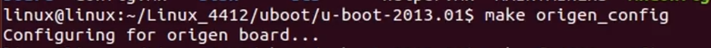

# 系统移植


# day01 嵌入式系统移植导学

## 移植的目的

- 不同架构CPU的指令集不兼容
- 相同CPU外围设备不同，驱动程序不兼容

- Linux是一个通用的内核，不能直接用于某平台
- 从官方获取Linux源代码后要和硬件平台适配
- 最后才能编译和安装

系统移植的宏观过程

**和windows类似**


## 开发板启动过程 

**memory map** 地址映射表 规定了CPU对于寻址空间的硬件级划分

对于三星4412处理器，CPU的SOC内部外设  ==iROM==  分配的是第一段内存

CPU刚上电的时候，PC寄存器默认是指向首地址0x0000


三星原厂在CPU的SOC出厂前默认在iROM中刷入了BL0固件

BL0=BootLoader 0

上电后默认执行BL0初始化相关的硬件，并且会识别到拨码开关的值，然后初始化启动方式

这里是设置成SD卡启动，SD卡预先烧录了uboot，然后BL0会把uboot加载到RAM中


加载完成后，BL0停止执行（收工），uboot开始执行

uboot会初始化栈、网卡、串口等基础硬件，然后把Linux内核加载到RAM（已经在EMMC烧录了Linux内核、dtb、rootfs）

再然后加载dtb（设备树）到RAM中

> 在Linux系统中驱动的代码和设备的信息是分离的，作用当软硬件升级了，只需要改设备信息，不需要改驱动，设备树中就是设备信息

接着就是加载rootfs（根文件系统）到RAM中

加载完成后，uboot停止执行，Linux系统启动


linux启动后进行全部软硬件的初始化，包括挂载根文件系统


对于不同厂商的CPU SOC的memory map不一样，在datesheet中详细说明


在华清的4412开发板上配置了4bit的拨码开关，可以主动选择启动方式

==拨码开关连接到哪里？==


对于 EMMC 和 SD卡 等硬盘中的内容CPU是不能直接访问到的，需要加载到内存中才可以


# day02 交叉开发环境搭建


## ubuntu网络配置要求

- 保证主机ubuntu可以连接互联网（外网），保证主机ubuntu和开发板在同一局域网（内网）

### tftp服务器

- ubuntu搭建tftp服务器环境，TCP/IP协议，在开发板安装客户端，实现**开发板下载服务器的文件到RAM**

### nfs服务器

- ubuntu搭建nfs服务器环境，DUP/IP协议，在开发板安装客户端，实现**远程挂载文件**到开发板RAM


# day03 uboot的烧写及使用


## Boot loader（引导 加载程序）概念

- **Boot loader**是引导加载程序的**统称**，**uboot**属于其常用的一种

- 在操作系统内核运行之前运行的一小段代码（裸机小程序）。
- 对软硬件进行相应的初始化（例如：驱动、C语言的栈）
- 为加载操作系统做准备，BT本身**不是操作系统**

## Boot loader 基本功能

- 初始化软硬件环境，串口，硬盘，屏幕

- 一般 uboot 中需要解决串口、 NAND 、 EMMC 或 SD 卡、网络和 LCD 驱动，因为 uboot

  的主要目的就是启动 Linux 内核，所以不需要考虑太多的外设驱动

- 引导加载LInux内核

- 给Linux内核**传参**（**Linux内核**运行的函数需要**入口参数**）

- 执行用户命令（类似于Shell命令）

## 常用bootloader

| **Bootloader** | **Monitor** | **描述**                                   | **X86** | **ARM** | **PowerPC** |
| -------------- | ----------- | ------------------------------------------ | ------- | ------- | ----------- |
| **LILO**       | **否**      | Linux磁盘引导程序                          | **是**  | **否**  | **否**      |
| **GRUB**       | **否**      | GNU的LILO替代程序                          | **是**  | **否**  | **否**      |
| **Loading**    | **否**      | 从DOS引导linux                             | **是**  | **否**  | **否**      |
| **ROLO**       | **否**      | 从ROM引导linux而不需要BOIS                 | **是**  | **否**  | **否**      |
| **Etherboot**  | **否**      | 通过以太网卡启动linux系统的固件            | **是**  | **否**  | **否**      |
| **LinuxBOIS**  | **否**      | 完全替代BUIS的linux引导程序                | **是**  | **否**  | **否**      |
| **BLOB**       | **是**      | LART等硬件平台的引导程序                   | **否**  | **是**  | **否**      |
| **U-boot**     | **是**      | 通用引导程序                               | **是**  | **是**  | **是**      |
| **RedBoot**    | **是**      | 基于eCos的引导程序                         | **是**  | **是**  | **是**      |
| **Vivi**       | **是**      | Mizi公司针对于三星的arm  cpu设计的引导程序 |         |         |             |

> 最常用是是uboot，兼容性最好

## SD卡的存储结构

- SD卡属于块设备，存储的最小单位是**512KByte**，每个单位称为**扇区**

- 每个扇区都有对应的编号，而第0号扇区固定存储**分区表**

- CPU上电后不会加载第0扇区的内容，所以uboot必须烧录到后面的扇区


使用SD卡制作uboot镜像

拨码开关设置成SD卡启动模式

插上SD Card后，连接串口查看到下面的日志即安装成功

这里是用SecureCRT连接串口，但是现在还是MoBaXterm好用


## uboot的使用

uboot的工作模式

- 自启动模式
  - 启动后默认倒计时结束后自动执行环境变量（bootcmd）中设置的命令
  - bootcmd中一般是加载和启动系统内核的命令
- 交互模式：
  - 在倒计时结束前，按下任意按键进入交互模式，可以输入uboot命令进行交互

### uboot命令帮助

打印uboot支持的全部命令：

```bash
user@host:~$ help
```

单独打印某个命令的详细信息：

```bash
user@host:~$ help loadb
```

### uboot环境变量

#### 打印环境变量：

```bash
user@host:~$ printenv
```

#### 修改环境变量：

这里修改后是默认保存到RAM，掉电后会丢失

```bash
user@host:~$ setenv [变量名] [数值]
```

修改环境变量后，保存到persistent storage（外部存储器）：

```bash
user@host:~$ saveenv
```

### uboot网络传输命令

```bash
#通过Kermit协议下载文件到指定的内存地址
user@host:~$ loadb [地址]
#通过tftp协议下载文件到指定的内存地址，需要预先配置好网络和tftp服务器
user@host:~$ tftp [地址] [文件名称]
```

uboot内部集成了tftp客户端

ubuntu主机的网络一定要采用桥接模式

### uboot存储器访问命令


后续用到这里的读写命令，把Linux内核写到EMMC

### uboot的自启动

##### bootcmd自启动环境变量

- 可以设置为一个或多个uboot命令的集合
- 多个命令用右斜杆和分号隔开\;
- 自启动模式下uboot默认顺序执行bootcmd中的命令，

后续的内核加载要用到这个bootcmd


# day04 Linux内核的安装与加载

## uboot启动linux内核命令

bootm命令（相当于go命令，但是go只能执行单个bin文件，无法启动整个内核）

```bash
user@host:~$ bootm kernel-addr ramdisk-addr atb-addr
# kernel-addr		内核地址
# ramdisk-addr		根文件系统地址
# atb-addr			设备树地址
```

ramdisk-addr 和 atb-addr是传递给linux内核的参数，拿到地址Linux才能使用根文件和设备树


- 这里通过tftp网络挂载的内核及其相关文件，方便开发前期的调试
- 对于成熟的产品，需要把内核及其相关文件下载到EMMC（用MMC命令）


Linux内核和设备树相当于可以Linux，而不需要有根文件系统也可以运行

又因为linux的内核中集成了nfs客户端，所以可以用nfs来挂载根文件系统


Linux内核启动后会使用uboot的自启动环境变量


# day05 交叉编译工具链

**toolchain**  交叉编译工具链获取途径

- 官网获取（需要自己配置）

- BSP板级支持包（厂家配置好了，上手快）


## ELF文件格式

- 就是之前的 a.out 文件的格式，类似于windows平台的exe文件

- elf是运行在Linux系统上的可执行文件 （二进制）

- elf文件内除了机器码（指令和数据）还有许多其他信息，离开Linux无法执行
- 同一个C语言文件编译成elf比bin大很多


## ELF文件相关命令

```bash
#查看任意文件的格式，类型，架构等信息
kidea@ubuntu:~$ file [文件名]
#显示ELF文件的头部信息
kidea@ubuntu:~$ readelf -h [a.out]
```

## bin文件

- bin是直接运行在CPU之上的可执行文件

- bin文件内只有机器码（指令和数据）

- uboot也是bin文件，属于裸机程序

## 常用工具

### size命令

查看elf文件与文件的执行有关的各个段的大小（指令和数据）


### nm命令

查看elf文件的符号段.symtab，c中函数名称，汇编中函数名，其他库的函数名


### strip命令

清除符号表


### objdump命令

 反汇编

把.elf文件转回.s汇编文件

**汇编反C语言是不可以的**

### objcopy命令

把elf转bin文件格式


# day06 uboot移植

uboot是开源的


uboot版本选择，直接问所使用开发板的开发厂商是最快的

- uboot本身就是c和汇编写的

这个课程使用的是下面这个版本


## uboot的源码结构


## 平台相关代码

- 即与CPU架构或开发板外设相关的源码，需要根据硬件进行修改

- arch：与CPU不同架构相关的源码
- board：与不同开发板相关的源码，包含各厂商的官方评估板对应的源码

### arch文件夹

这里用的是ARM架构，所以可以把其他架构的代码删除


在ARM中细分很多架构，对于这里的Cortex-A9来说是armv7架构


下面是本课程使用的armv7架构的CPU相关的代码


### board文件夹

都是一些CPU设计公司的名字，本课程用的是三星的4412CPU，所以参考三星的==评估板==驱动


华清远见的4412开发板就是参考官方的评估板来设计的


###  common文件夹

是uboot的命令实现的源码，也可以自己加命令

### disk文件夹

磁盘的相关代码

### README文件和doc文件夹

README是大概的使用说明，doc是详细的说明文档

### driver文件夹

外围硬件的驱动


### dts文件夹

设备树文件，驱动课程的学习重点

### fs文件夹

支持的文件系统的实现的源码


### net文件夹

各种网络协议的源码


### post文件夹

开发板上电自检


## uboot配置和编译

### 选择开发板

在uboot的源码**顶层目录**下执行**make命令**指定的评估板



```bash
kidea@ubuntu:~/uboot/u-boot-2013.01$ make <board_name>_config
```

注意这里的评估板是芯片公司的开发板，而不是开发板公司的开发板

### 指定编译器

修改**顶层**的Makefile指定编译uboot源码使用的编译器


### 开始编译

在**顶层目录**执行make命令

编译完成后会多了下面这些文件：


u-boot是elf格式的文件

u-boot.bin可以直接刷到开发板

> 注意这里的u-boot.bin适配的是三星的origen评估板（4412CPU）

### 清除中间件

执行make clean清除中间文件，即.o文件

> 如果执行make distclean可以清除所有编译生成的文件


## 正式适配移植uboot

对于三星的origen评估板和华清的FS4412开发板来说

- CPU使用的都是4412的SOC，所以arch文件夹不用修改
- 两者使用的外设不一样，所以主要是修改board文件夹的源代码


# day07 Linux内核移植

# day08 Linux设备驱动移植

# day09 根文件系统移植
