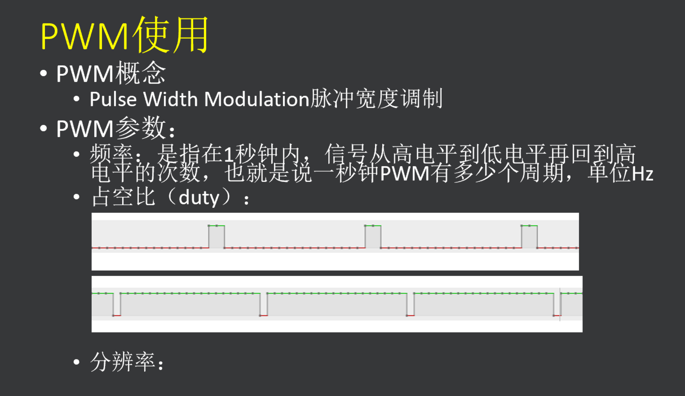

# ESP32学习笔记

MCU：ESP32

开发环境：ESP-IDF 4.3

idf使用方式：powerShell

代码编辑器：SourceInsight 4.0

串口工具：友善串口调试工具

串口芯片：CH340 

> 讲的跟s一样，给有学过stm32的同学快速入门esp

---

# DAY1-ESP32资源&开发环境

编译程序：

```shell
PS D:\Espressif\frameworks\esp-idf-v5.1.2> cd .\examples\get-started\hello_world
#cd到项目文件夹下
PS D:\Espressif\frameworks\esp-idf-v5.1.2\examples\get-started\hello_world> idf.py build
#第一次编译有点久
```

下载程序：

先一直按住boot，再按一下reset松开

然后执行下载命令

```shell
PS D:\Espressif\frameworks\esp-idf-v5.1.2\examples\get-started\hello_world>idf.py -p (PORT) flash
#PORT填自己的串口号，（在设备管理器中查看）
```

出现Connecting……..松开boot即可

串口打印的信息可以在串口助手查看

> 华清远见的这套开发环境有点老了，还是在vscode里用idf插件开发方便
>
> SourceInsight的主题实在太丑，远不如vscode

# DAY2-GPIO的初始化&中断

**GPIO的初始化**有2种**API**

- 直接调对应的函数
- 创建GPIO结构体**实例**

**GPIO的中断**

调用**FreeRTOS**的中断服务API


# DAY3-ESP32 定时器



这里用的是软件定时器，esp32内有4个硬件定时器

利用定时器实现PWM

可以用于模拟串口等应用


# DAY4-ESP32 模数转换

esp32内置的adc最大只能读2000多mV的电压

不是所有的引脚都能配置adc，具体看datesheet

 dac可以给引脚输出电压，配合余弦波发生器可以输出余弦波，需要用示波器看


# DAY5-ESP32 I2C总线

软件iic的速度远不及硬件iic

slave 从机  每个slave都有唯一的address

master 主机

## iic的时序

可以发送寄存器或**寄存器组**的数据帧

驱动iic的屏幕

初始化代码

点阵屏幕底层显示的字符信息需要取模


可以调用lvgl的图形API

学习驱动和lvgl的适配初始化

然后调用lvgl的接口显示就可以了

lvgl的显示也可以用别的图形化工具来自动生成代码


# DAY7-ESP32 SPI总线使用


全双工通信

两条数据线 

可以同时收发数据


# DAY8-ESP32 sd卡接口使用


# DAY9-Wi-Fi介绍和STA、AP实现


# DAY10-WiFi tcp通信


# DAY11-WiFi udp通信实战


# DAY12-ESP32 http 实现


# Level 20 ESP32综合项目实战


# Level 21 ESP32蓝牙开发及实战
