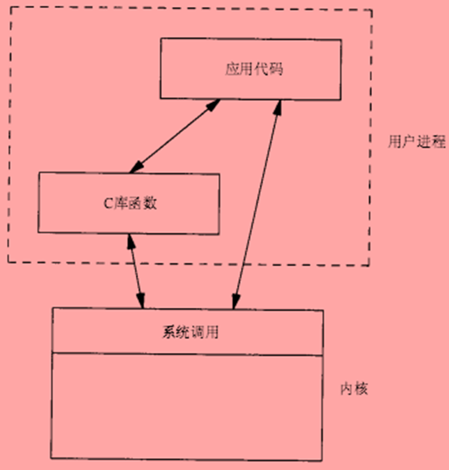
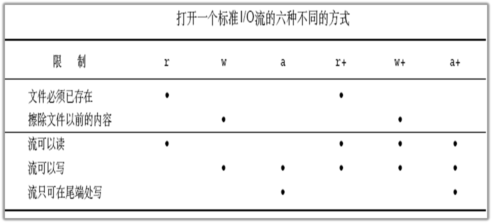

**Linux应用开发**

华清远见-大海老师-2018录播课

| 课程结构 | 学习周期 |
| -------- | -------- |
| 文件IO   | 5 Days   |
| 进程线程 | 9 Days   |

编程平台：

Ubuntu teminal下使用vim编辑器、gcc编译器

---


# Day01 标准IO

**I/O  :  Input/Output**

Linux下一切皆是文件

## 文件基础知识

### 文件概念

- 一组相关数据的有序集合（例如：硬盘里的文件）

### 文件类型

1. 常规文件  r 

2. 目录文件  d

3. 字符设备文件  c

4. 块设备文件  b（硬盘由flash块组成）

5. 管道文件  p

6. 套接字文件  s

7. 符号链接文件  l

### UNIX软件结构



### 标准I/O 概念

ANSI C，也称为C89或C90标准，是C语言的一种标准规范，旨在统一C语言的语法、数据类型、函数库和预处理器等方面的规范。

### 流

FILE

- 标准IO用一个结构体类型来存放打开的文件的相关信息

- 标准I/O的所有操作都是围绕FILE来进行

stream

- FILE又被称为流(stream)

-  文本流/二进制流

Windows

 二进制流：  换行符   ‘\n’ 

   文本流：  换行符   ‘\r’    ‘\n’

 Linux

​     换行符    ‘\n’ 

### 流的缓冲类型

**全缓冲**

- 当流的缓冲区无数据或无空间时才执行实际I/O操作

**行缓冲**

- 当在输入和输出中遇到换行符(‘\n’)时，进行I/O操作

-  当流和一个终端关联时，典型的行缓冲

**无缓冲**

- 数据直接写入文件，流不进行缓冲区

### 标准I/O预定义3个流

| 3个标准    | 序号 | 结构体类型    | 实例   |
| ---------- | ---- | ------------- | ------ |
| 标准输入流 | 0    | STDIN_FILENO  | stdin  |
| 标准输出流 | 1    | STDOUT_FILENO | stdout |
| 标准错误流 | 2    | STDERR_FILENO | stderr |

标准IO的对应头文件就是<stdio.h>


---

---


## 缓冲区的输出

- 程序结束时**缓冲区**内容输出

```c
#include <stdio.h>

int main(int argc,char*argv[])
{
    printf("hello kidea");
    //printf()函数实现输出
}
```

- 程序循环不结束，缓冲区的内容无法打印出来

```c
#include <stdio.h> //printf()的库
#include <unistd.h> //sleep()的库

int main(int argc,char*argv[])
{
    printf("hello kidea");
    
    while(1){
        sleep(1); //延时1秒，释放系统资源
    }
}
```

- 行缓冲，缓冲区遇到/n会输出该行内容

```c
#include <stdio.h> 
#include <unistd.h> 

int main(int argc,char*argv[])
{
    printf("hello kidea \n ");
    
    while(1){
        sleep(1); //延时1秒，释放系统资源
    }
}
```

- 全缓冲，缓冲区内存被占满时输出

这里的缓冲区是1k byte，一个字符1 byte

```c
#include <stdio.h> 
#include <unistd.h> 

int main(int argc,char*argv[])
{
    int i=0;
    for(i=0;i<1025;i++){
        printf("a");
    }
    
    while(1){
        sleep(1); //延时1秒，释放系统资源
    }
}
```

## 打开文件

也是标准库的函数

```c
FILE *fopen (const char *path, const char *mode);
//成功打开文件时返回文件流指针
//出错返回NULL空指针
//path表示被打开文件的路径，打开当前文件夹内的文件不用填也可以
```

| mode | 参数  | 作用                                                         |
| ---- | ----- | ------------------------------------------------------------ |
| “r”  | “rb”  | 以只读方式打开文件，文件必须存在。                           |
| “r+” | ”r+b” | 以读写方式打开文件，文件必须存在。                           |
| “w”  | “wb”  | 以只写方式打开文件，若文件存在则文件长度清为0。若文件不存在则创建。 |
| “w+” | “w+b” | 以读写方式打开文件，若文件存在则文件长度清零，若文件不存在则创建。 |
| “a”  | “ab”  | 以只写方式打开文件，若文件不存在则创建；向文件写入的数据被追加到文件末尾。 |
| “a+” | “a+b” | 以读写方式打开文件。若文件不存在则创建；向文件写入的数据被追加到文件末尾 |



```c
#include <stdio.h>
#include <errno.h>
#include <string.h>

int main(int argc,char *argv[]){
    FILE *fp; //结构体的指针
    int fpret;
    
    fp = fopen("1.txt","r"); //只读模式打开当前文件夹的1.txt文件
    
    if(fp==NULL){
        
        //fopen()函数返回NULL时打印错误信息
        //printf("Open file Failed\n");
        
        perror("fopen"); //来自标准库，void perror(const char *s);先输出字符串s，再输出错误号对应的错误信息

        
        printf("fopen:%s\n",strerror(errno)); // char *strerror(int errno);根据错误号返回对应的错误信息，函数来自：<errno.h>入口参数来自：<string.h>

    }
    else{
	printf("Open file success\n");
       // perror("open");成功的分支打印错误信息没有意义
       fpret = fclose(fp); //关闭文件
       if(fpret==0){
            printf("file close sucess\n");
       }else{
            perror("fclose");
       }
    }
    

}

```

## 关闭文件

```c
int fclose(FILE *stream)；
//入口参数为，文件流指针
//fclose()调用成功返回0，失败返回EOF，并设置errno

```

- 文件流关闭时自动刷新缓冲中的数据并释放缓冲区

- 当一个程序正常终止时，所有打开的文件流都会被关闭。

- 文件流一旦关闭后就不能执行任何操作
- 没打开的文件不能关闭，否则报段错误
- 程序能打开的文件数有限（1021 + stdin + stdout + stderr = 1024）

# day02 标准IO的读写

读写字符的API

读写字符串的API


输出-读取 Get

- 读取文件中的字符或字符串
- 读取键盘输入的字符或字符串

输入-写入 Put

- 将程序中的字符或字符串写入到文件
- 将键盘输入的字符或字符串写到终端


普通文本文件的读写和二进制 文件读写的API不一样

---

文本文件只能存取ASCII码表中的字符（键盘上有的符号）

vim只能查看文本文件，查看二进制文件会乱码（显示成对应的ASCII或随机）

- 二进制文件的读写

```c
#include <stdio.h>
#include <stdlib.h>

int main(int argc,char *argv[]){
   FILE *fp;
   char *buff;   
   size_t ret;
   fp=fopen("1.txt","r");
   if(fp==NULL){
      perror("fopen");
      return 0;
   }
   
   buff=(char*)malloc(100); //<stdlib.h>
   if(buff==NULL){
      return 0;

   }

   ret = fread(buff,10,1,fp);
   if(ret==-1){
       perror("fread");
       goto end;
   }
   
   printf("buf=%s\n",buff); 

end:
   free(buff);
   fclose(fp);

}

```

---

[Readme2](../C&C++语言学习/Linux-C学习笔记.md)
