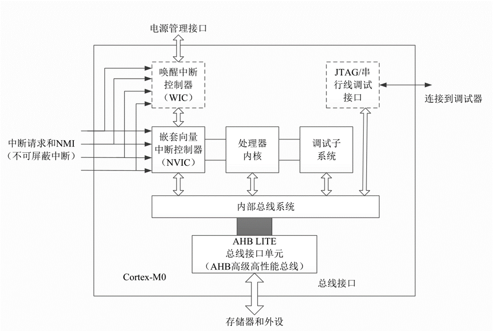

# STM32F407裸机开发学习笔记

知识源：华清远见-陈老师

硬件平台：Cortex-M4-STM32F407（华清自己的开发板）

软件平台：hal库

---

# ARM的基本常识

SoC的框架

## ARM（Advanced RISC Machines)

- 一家公司的名称
- 一种CPU的架构
- 一种技术的名称

### ARM架构

基于ARM架构定义指令集和==编程模型==（基本数据类型、工作模型、寄存器组）

#### ARM架构的版本

   V1-V3 最早的版本，目前已废弃

   V4-V6 经典处理器中运用的比较多

   V7 目前Cortex系列处理器主要是这种架构、支持Thumb-2的32位指令集（Cortex-M4就是这个版本）

   V8 兼容ARMv7架构的特性，并支持64位数据处理

##### 指令集

###### 概念

- 处理器能够识别并执行的指令集合；

- 每一条指令可处理一个简单或复杂操作（加、加乘…）；

- 每一条指令对应一条或几条汇编指令。

###### 分类

- 复杂指令集（CISC）：包含处理复杂操作的特定指令，指令长度不固定，执行需要多个周期。

- 精简指令集（RISC）：指令简单而有效，格式和长度通常是固定的，大多数指令在一个周期内可以执行完毕，（ARM内核基于RISC）

#### ARM的三个系列

##### Cortex-M 

为单片机驱动的系统提供的低成本优化方案，应用于传统

的微控制器市场，智能传感器，汽车周边部件等。

##### Cortex-A 

针对开放式操作系统的高性能处理器；

应用于智能手机，数字电视，服务器等高端运用。 

##### Cortex-R 

针对实时系统、满足实时性、高可靠性控制需求；

应于汽车制动系统，动力系统，移动通信基带控制器等。

### Cortex-M的子系列

Cortex-M0 ：主打低功耗和混合信号的处理

Cortex-M1 ：应用于FPGA的应用控制领域

Cortex-M3和==Cortex-M4== 主要用来替代 ARM7,重点侧重能耗与性能的平衡

 Cortex-M7： 则重点放在高性能控制运算领域。

## Cortex-M4

### 内核特性：

- ARMCortex™-M4处理器内核是在Cortex-M3内核基础上发展起来的，其性能比Cortex-M3提高了20%。新增加了浮点、DSP、并行计算等。

- RISC处理器内核：高性能32位CPU

-  ==Thumb-2 指令集==，高效、高代码密度；

- 高性能，使用ARMv7-M的体系架构支持DSP和SIMD；

- 中断数量可配置（1~240个），低中断切换时延，提供不可屏蔽中断（NMI）输入保障高可靠性系统；

- 低功耗模式：集成的睡眠状态支持、多电源域、基于架构的软件控制；

- 支持多种嵌入式操作系统，也被多种开发组件支持，包括 MDK（ARM Keil 微控制器开发套件）、RVDS（ARM RealView 开发组件）、IAR C 编译器等。

### 结构框架

---

---

### 工作模式

#### 处理模式（Handler Mode）

  当处理器发生了==异常或者中断==，则进入处理模式进行处理、处理完成后返回线程模式。在该模式下处理器一定具有==特权==访问等级，可以访问处理器中的所有资源。

#### 线程模式（Thread Mode）：

  芯片复位后，即进入线程模式，执行普通用户程序；可以切换特权或非特权模式，访问等级由CONTROL寄存器控制

### 工作状态

- Thumb状态：正常运行时处理器的状态

- 调试状态：调试程序时处理器的状态，调试器可以访问或修改处理器中寄存器的值。

### 寄存器组

- ##### R0-R12：13个通用寄存器

  - R00-R07 为低端寄存器，可作为 16 位或 32 位指令==操作数==
  - R08-R12 为==高端==寄存器，只能用作==32位==操作数
  - 用于计算过程中临时存放数据

- ##### R13：堆栈指针（ SP）

  - Cortex-M4 在物理位置上存在两个栈指针，==主栈指针 MSP==，==进程栈指针 PSP==

  - 在==处理模式==下，只能使用==主堆栈==
  - 在==线程模式==下，可以使用主堆栈也可以使用进程堆栈
  - 这主要是由 CONTROL 寄存器控制完成
  - 系统上电的==默认==栈指针是==MSP==
  - c语言在运行时需要SP在内存中开辟栈空间，用于存放局部变量、函数参数、返回地址
  - 裸机一般只用MSP就够了

- ##### R14：连接寄存器   (LR)

  - 用于存储==子程序==或者函数调用的==返回地址==

- ##### R15：程序计数器 （PC）

  - 存储==下一条==将要执行的指令的==地址==。

- ##### 特殊寄存器xPSR：

  ##### 组合程序状态寄存器，该寄存器由三个程序状态寄存器组成

  - 应用PSR（APSR） ：  包含前一条指令执行后的条件标志

  - 中断PSR（IPSR） ： 包含当前ISR的异常编号

  -  执行PSR（EPSR） ： 包含Thumb状态位

    ==在Cortex-A9的课程会深入学习这里，现在大概看看就好==
    
    

- PRIMSK：中断屏蔽特殊寄存器。

- CONTROL：控制寄存器

  - PRIV  为0，处理器处于线程模式的特权级，为1为非特权级

  - SPSEL 为0时，线程模式使用MSP，为1时使用PSP

  - 处理器模式时，固定使用MSP

    

### 中断处理

==在后面的中断章节详细介绍，这里大概看一下==

处理器内部产生的中断称为异常，CMSIS中断是外部的中断（240个）

通过查询异常向量表处理中断

### Cortex-M4指令集的细分

- ARM 处理器支持两种指令集：ARM 和 Thumb。

- EPSR 寄存器的 T 标志位负责指令集的切换
- Cortex-M0只支持Thumb指令。

####  ARM指令集

- 32位精简指令集；

- 指令长度固定；

- 降低编码数量产生的耗费，减轻解码和流水线的负担；

#### Thumb指令集

- Thumb指令集是ARM指令集的一个子集；

- 指令宽度16位；

- 与32位指令集相比，大大节省了系统的存储空间；

- Thumb指令集不完整，所以必须配合ARM指令集一同使用。

#### 对比

- Thumb与ARM相比，代码体积小了30%，但性能也低了20%。

- 2003年，ARM公司引入了Thumb-2技术，具备了一些32位的Thumb指令，使得原来很多只有ARM指令能够完成的功能，用Thumb指令也可以完成了。

- Cortex-M4基于的ARMv7-M体系结构，该体系结构的处理器只是用了16位Thumb指令和部分32位Thumb指令

# STM32的基本常识

- STM32，其中ST 是意法半导体，M 是 Microelectronics 微控制器，32 表示32 位。

## 命名规范

## STM32F4系统架构

- STM32F407 采用的是 Cortex-M4 内核，==内核即 CPU==，由 ARM公司设计。

- ARM 公司并不生产芯片，而是出售其芯片技术授权。

- 芯片生产厂商(SOC)如 ST、TI、Freescale，负责在内核之外设计部件并生产整个芯片

- 这些内核之外的部件被称为核外外设或==片上外设==。如 GPIO、USART（串口）、I2C、SPI等都叫做片上外设。

## 华清远见STM32F407开发板结构

具体硬件资源看==原理图==（核心板+外设，只有PDF，TAT）

> Day1 end

[TOC]

