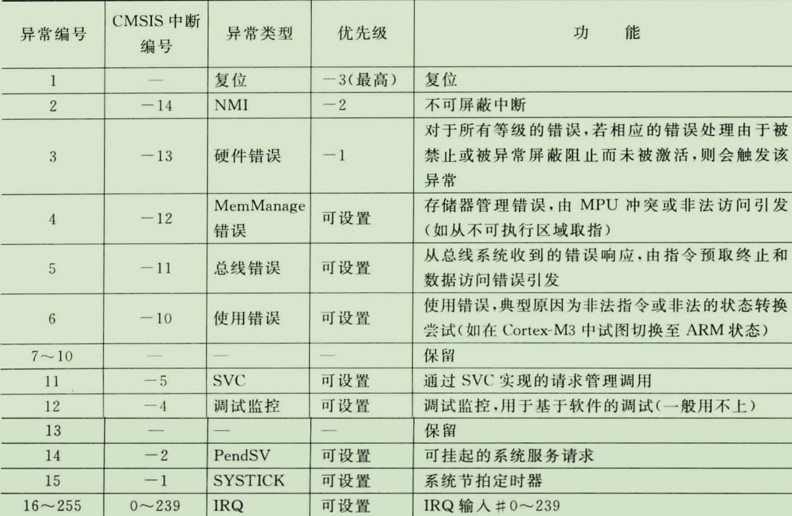

# STM32F407裸机开发学习笔记

- 知识源：华清远见-陈老师（18 Days）

- 硬件平台：STM32F407IGT6（华清自己的开发板）

- 软件平台：

  - MDK-Keil uVision5

  - STM32CubeMX-hal库（图形化调库）

  - ST-Link（调试器）【驱动版本：ST-LINK Utility_v3.1.0】

---

# ARM的基本常识

SoC的框架


## ARM（Advanced RISC Machines)

- 一家公司的名称
- 一种CPU的架构
- 一种技术的名称

### ARM架构

基于ARM架构定义指令集和==编程模型==（基本数据类型、工作模型、寄存器组）

#### ARM架构的版本

   V1-V3 最早的版本，目前已废弃

   V4-V6 经典处理器中运用的比较多

   V7 目前Cortex系列处理器主要是这种架构、支持Thumb-2的32位指令集（Cortex-M4就是这个版本）

   V8 兼容ARMv7架构的特性，并支持64位数据处理

##### 指令集

###### 概念

- 处理器能够识别并执行的指令集合；

- 每一条指令可处理一个简单或复杂操作（加、加乘…）；

- 每一条指令对应一条或几条汇编指令。

###### 分类

- **精简指令集（RISC）：**
  - 指令简单而有效，格式和长度通常是固定的，大多数指令在一个周期内可以执行完毕，（ARM内核基于RISC）
  - 只保留常用的的简单指令，硬件结构简单，复杂操作一般通过简单指令的组合实现，一般指令长度固定，且多为单周期指令
  -  RISC处理器在功耗、体积、价格等方面有很大优势，所以在嵌入式移动终端领域应用极为广泛
- **复杂指令集（CISC）**
  - 包含处理复杂操作的特定指令，指令长度不固定，执行需要多个周期。（X86架构）
  - 不仅包含了常用指令，还包含了很多不常用的特殊指令，硬件结构复杂，指令条数较多，一般指令长度和周期都不固定
  -   CISC处理器在性能上有很大优势，多用于PC及服务器等领域

#### ARM的三个系列

##### Cortex-M 

为单片机驱动的系统提供的低成本优化方案，应用于传统

的微控制器市场，智能传感器，汽车周边部件等。

##### Cortex-A 

针对开放式操作系统的高性能处理器；

应用于智能手机，数字电视，服务器等高端运用。 

##### Cortex-R 

针对实时系统、满足实时性、高可靠性控制需求；

应于汽车制动系统，动力系统，移动通信基带控制器等。

### Cortex-M的子系列

Cortex-M0 ：主打低功耗和混合信号的处理

Cortex-M1 ：应用于FPGA的应用控制领域

Cortex-M3和==Cortex-M4== 主要用来替代 ARM7,重点侧重能耗与性能的平衡

 Cortex-M7： 则重点放在高性能控制运算领域。

## Cortex-M4

### 内核特性：

- ARMCortex™-M4处理器内核是在Cortex-M3内核基础上发展起来的，其性能比Cortex-M3提高了20%。新增加了浮点、DSP、并行计算等。
- RISC处理器内核：高性能32位CPU
- ==Thumb-2 指令集==，高效、高代码密度；
- 高性能，使用ARMv7-M的体系架构支持DSP和SIMD；
- 中断数量可配置==（1~240个）==，低中断切换时延，提供不可屏蔽中断（NMI）输入保障高可靠性系统；
- 低功耗模式：集成的睡眠状态支持、多电源域、基于架构的软件控制；
- 支持多种嵌入式操作系统，也被多种开发组件支持，包括==MDK==（ARM Keil 微控制器开发套件）、RVDS（ARM RealView 开发组件）、IAR C 编译器等。

### 结构框架

单总线控制：冯诺依曼架构


---

---


### 工作模式

#### 处理模式（Handler Mode）

  当处理器发生了==异常或者中断==，则进入处理模式进行处理、处理完成后返回线程模式。在该模式下处理器一定具有==特权==访问等级，可以访问处理器中的所有资源。

#### 线程模式（Thread Mode）：

  芯片复位后，即进入线程模式，执行普通用户程序；可以切换特权或非特权模式，访问等级由CONTROL寄存器控制

### 工作状态

- Thumb状态：正常运行时处理器的状态

- 调试状态：调试程序时处理器的状态，调试器可以访问或修改处理器中寄存器的值。


### 寄存器组

- ##### R0-R12：13个通用寄存器

  - R00-R07 为低端寄存器，可作为 16 位或 32 位指令==操作数==
  - R08-R12 为==高端==寄存器，只能用作==32位==操作数
  - 用于计算过程中临时存放数据

- ##### R13：堆栈指针（ SP）

  - Cortex-M4 在物理位置上存在两个栈指针，==主栈指针 MSP==，==进程栈指针 PSP==

  - 在==处理模式==下，只能使用==主堆栈==
  - 在==线程模式==下，可以使用主堆栈也可以使用进程堆栈
  - 这主要是由 CONTROL 寄存器控制完成
  - 系统上电的==默认==栈指针是==MSP==
  - c语言在运行时需要SP在内存中开辟栈空间，用于存放局部变量、函数参数、返回地址
  - 裸机一般只用MSP就够了

- ##### R14：连接寄存器   (LR)

  - 用于存储==子程序==或者函数调用的==返回地址==

- ##### R15：程序计数器 （PC）

  - 存储==下一条==将要执行的指令的==地址==。


- ##### 特殊寄存器xPSR：

  ##### 组合程序状态寄存器，该寄存器由三个程序状态寄存器组成

  - 应用PSR（APSR） ：  包含前一条指令执行后的条件标志

  - 中断PSR（IPSR） ： 包含当前ISR的异常编号

  -  执行PSR（EPSR） ： 包含Thumb状态位

    ==在Cortex-A9的课程会深入学习这里，现在大概看看就好==
    
    

- PRIMSK：中断屏蔽特殊寄存器。

- CONTROL：控制寄存器

  - PRIV  为0，处理器处于线程模式的特权级，为1为非特权级

  - SPSEL 为0时，线程模式使用MSP，为1时使用PSP

  - 处理器模式时，固定使用MSP

    


### 中断处理

==在后面的中断章节详细介绍，这里大概看一下==

处理器内部产生的中断称为异常，CMSIS中断是外部的中断（240个）

通过查询异常向量表处理中断



### Cortex-M4指令集的细分

- ARM 处理器支持两种指令集：ARM 和 Thumb。

- EPSR 寄存器的 T 标志位负责指令集的切换
- Cortex-M0只支持Thumb指令。

####  ARM指令集

- 32位精简指令集；

- 指令长度固定；

- 降低编码数量产生的耗费，减轻解码和流水线的负担；

#### Thumb指令集

- Thumb指令集是ARM指令集的一个子集；

- 指令宽度16位；

- 与32位指令集相比，大大节省了系统的存储空间；

- Thumb指令集不完整，所以必须配合ARM指令集一同使用。

#### 对比

- Thumb与ARM相比，代码体积小了30%，但性能也低了20%。

- 2003年，ARM公司引入了Thumb-2技术，具备了一些32位的Thumb指令，使得原来很多只有ARM指令能够完成的功能，用Thumb指令也可以完成了。

- Cortex-M4基于的ARMv7-M体系结构，该体系结构的处理器只是用了16位Thumb指令和部分32位Thumb指令

# STM32的基本常识

- STM32，其中ST 是意法半导体，M 是 Microelectronics 微控制器，32 表示32 位。

## 命名规范


## STM32F4系统架构

- STM32F407 采用的是 Cortex-M4 内核，==内核即 CPU==，由 ARM公司设计。

- ARM 公司并不生产芯片，而是出售其芯片技术授权。

- 芯片生产厂商(SOC)如 ST、TI、Freescale，负责在内核之外设计部件并生产整个芯片

- 这些内核之外的部件被称为核外外设或==片上外设==。如 GPIO、USART（串口）、I2C、SPI等都叫做片上外设。


## 华清远见STM32F407开发板结构


$1800 … 具体硬件资源看==原理图==（核心板+外设，只有PDF，TAT）

> Day1 end

---

# 开发环境

- ##### Keil MDK-ARM （Microcontroller Development Kit）

  - 为基于Cortex-M、Cortex-R4、ARM7、ARM9处理器设备提供了一个完整的开发环境
  - 有四个可用版本，分别是MDK-Lite、MDK-Basic、MDK-Standard、 MDK-Professional
  - 所有版本均提供一个完善的C / C++开发环境，
  - 其中MDK-Professional还包含大量的中间库

> [!TIP]
>
> ==高端的Cortex-A系列直接用Linux交叉开发，不需要MDK==

## Keil MDK-ARM  功能特点

- 完美支持Cortex-M、Cortex-R4、ARM7和ARM9系列器件。
- 行业领先的ARM C/C++编译工具链
- 确定的Keil RTX ，小封装实时操作系统（带源码）
- μVision5 IDE集成开发环境，调试器和仿真环境
- TCP/IP网络套件提供多种的协议和各种应用
- 为带图形用户接口的嵌入式系统提供了完善的GUI库支持
- ULINKpro可实时分析运行中的应用程序，且能记录Cortex-M指令的每一次执行
- 大量的项目例程帮助你快速熟悉MDK-ARM强大的内置特征
- 符合==CMSIS== (Cortex微控制器软件接口标准)

## 官网下载MDK（版本5.23）

https://www.keil.com/demo/eval/arm.htm#/DOWNLOAD

离线包在课件可以直接用（但是注册机没了TAT）


> [!IMPORTANT]
>
> - 一路naxt
> - 修改路径不能出现中文
> - 安装完keil后安装Pack包也是一路naxt
> - 最后用注册机破解（管理员运行）

- 破解后pack无法正常安装，如下图修改keil的文件夹的User权限即可正常安装


## 安装ST-Link驱动（调试工具）


## STM32CubeMX

官网：（需要注册账户）

http://www.st.com/en/development-tools/stm32cubemx.html

本地：（该软件是基于java的）


---


# 地址空间

## Cortex-M4存储器映射


## STM32F407存储器映射


- 具体外设地址参考STM32F4X7数据数据手册第4章Memory map


# 寄存器的访问

- 以**GPIOA**寄存器组为例：

| 寄存器名称 | 偏移地址                  |
| ---------- | ------------------------- |
| MODER;     | /*Address offset: 0x00 */ |
| OTYPER;    | /*Address offset: 0x04 */ |
| OSPEEDR;   | /*Address offset: 0x08 */ |
| PUPDR;     | /*Address offset: 0x0C */ |
| IDR;       | /*Address offset: 0x10 */ |
| ODR;       | /*Address offset: 0x14 */ |
| BSRR;      | /*Address offset: 0x18 */ |
| LCKR;      | /*Address offset: 0x1C */ |

- 寄存器的实际地址=起始地址+偏移地址
- ==起始地址==查数据手册的==存储器映射表==
- 十六进制的基本单位是1个字节，32位寄存器4个字节R

## 常规方法访问寄存器ODR

```c
//方法一：
#define GPIOA_BASE ((unsigned int)0x40020000) //起始地址
#define GPIOA_ODR (GPIOA_BASE + 0x14) //实际地址=起始地址+偏移地址

val  = *(unsigned int *) GPIOA_ODR  ; //读操作
*(unsigned int *)  GPIOA_ODR = val  ; //写操作
```

```c
//方法2:
#define GPIOA_ODR (*(unsigned int *)(GPIOA_BASE + 0x14))

val = GPIOA_ODR  ;    //读
GPIOA_ODR = val  ;    //写
```

## 使用结构体封装寄存器组

```c
//关键词typedef的作用是对数据类型进行重命名
//这里将struct类型重命名为GPIO_TypeDef
//然后可以使用GPIO_TypeDef类型名来声名struct的实例
//结构体成员的偏移地址在更底层的库文件中定义
//这里是应用层的代码
typedef struct {
uint32_t MODER;     /*Address offset(偏移): 0x00 */
uint32_t OTYPER; 	/*Address offset: 0x04 */
uint32_t OSPEEDR; 	/*Address offset: 0x08 */
uint32_t PUPDR;	 	/*Address offset: 0x0C */
uint32_t IDR; 		/*Address offset: 0x10 */
uint32_t ODR; 		/*Address offset: 0x14 */
uint32_t BSRR; 		/*Address offset: 0x18 */
uint32_t LCKR; 		/*Address offset: 0x1C */
} GPIO_TypeDef;

#define GPIOA_BASE ( (unsigned int ) 0x40020000 ) //将起始地址强制转换为无符号整型
#define GPIOA ((GPIO_TypeDef *) GPIOA_BASE) //将起始地址强制转换为结构体的指针类型

GPIOA->ODR = 0x16 ; //直接用指针改寄存器的值
//因为在更底层的代码中设置好了偏移地址，所以这里可以直接访问
```

# 单片机启动流程

先学后面的再回来写启动流程的笔记


> Day2 End

---


# GPIO编程

STM32F407IGT6 型号的芯片有 GPIOA、GPIOB、GPIOC 至 GPIOI共 9组 GPIO，每组GPIO最多16个引脚

芯片一共 176 个引脚

## 基本功能

- 每个引脚都有的基本输入输出功能
- 输入模式：读取引脚电平
- 输出模式：释放高低电平

## 复用功能

- 一个GPIO最多可以配置为16种复用功能中的一种
- 具体功能查看数据手册3.6


> Day3 End


