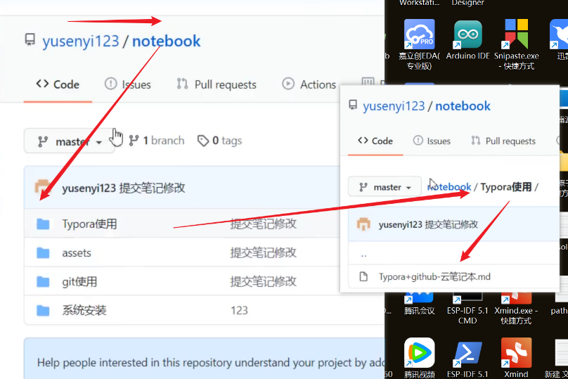

# Typora+Github实现云笔记

---

参考up的视频

[打造自己的云笔记本（Typora+github/码云），简单好用，学习效率翻倍，我要是早点学会就好了_哔哩哔哩_bilibili](https://www.bilibili.com/video/BV14f4y1Q7eu/?spm_id_from=333.337.search-card.all.click&vd_source=168cfdeaa638dd4ee22415c821287ce1)

Up的笔记地址

[notebook/Typora使用/Typora+github-云笔记本1.0.md at master · yusenyi123/notebook](https://github.com/yusenyi123/notebook/blob/master/Typora使用/Typora%2Bgithub-云笔记本1.0.md)

修改config文件后才能成功上传笔记