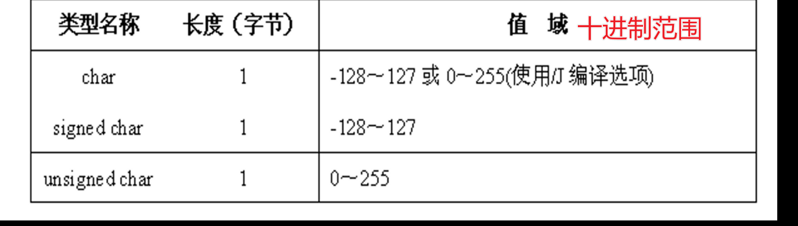
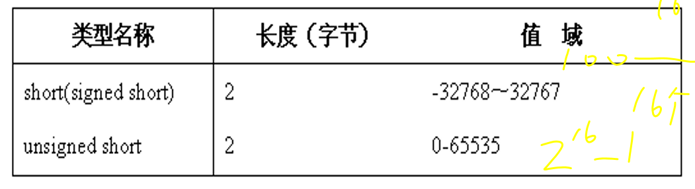
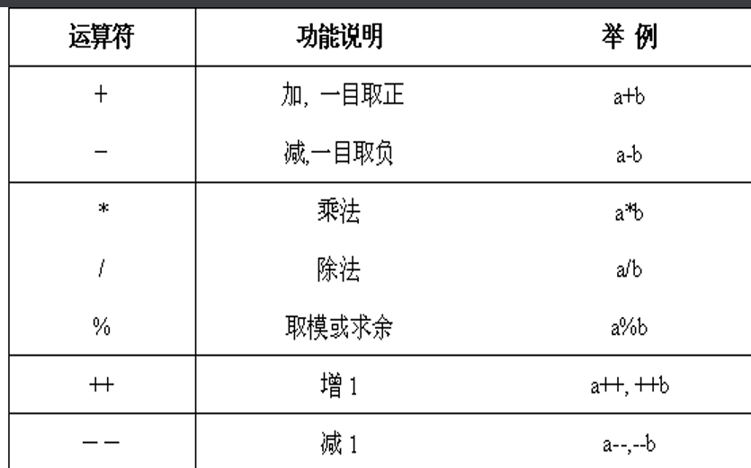
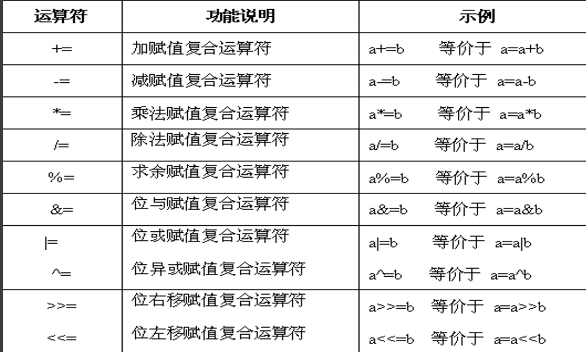
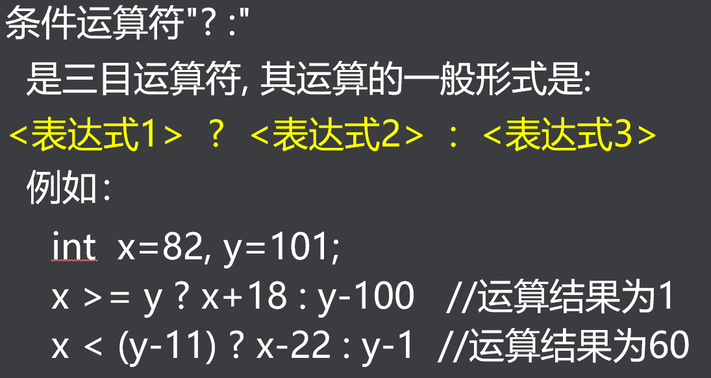
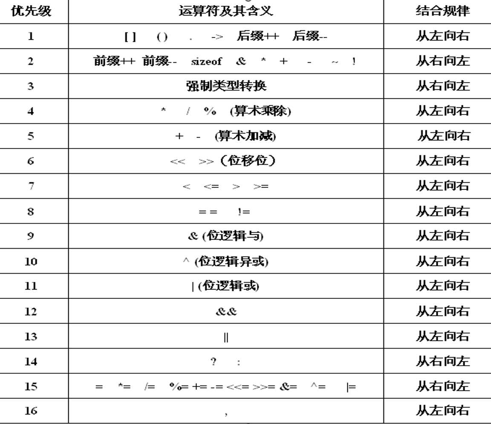
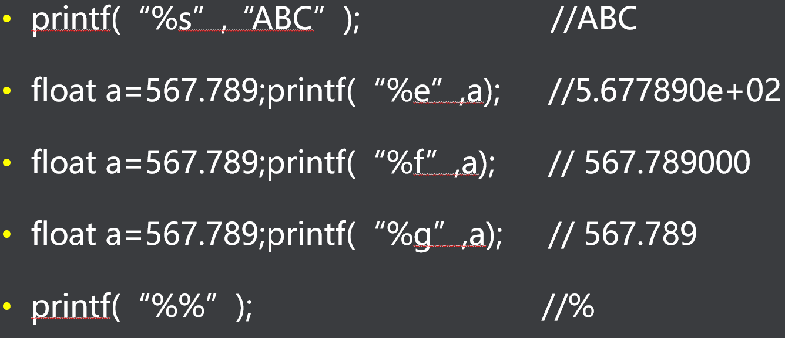
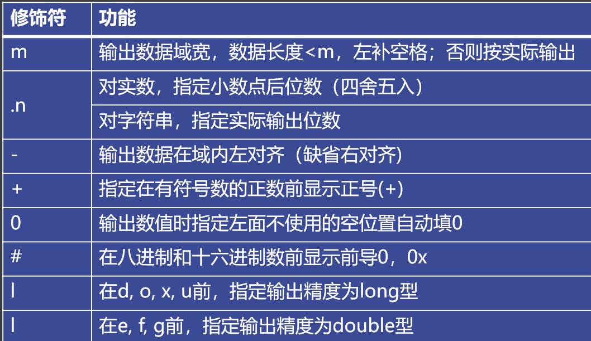

**C语言 学习笔记**

form：华清远见-小美老师。。。

开发平台：Ubuntu-14.04 

编译器：gcc 

编辑器：Vim | NVim | neoVim

---


# Day01 必备Linux命令和C语言基础

## 数据类型

所有数据（数字、字母、字符&字符串、特殊符号）最后都会变成2进制（机器语言）

---


## 数值数据

| 十六进制 HEX | 十进制 DEC | 二进制 BIN |
| :----------: | :--------: | :--------: |
|     0x00     |    000     |    0000    |
|     0x01     |    001     |    001     |
|     0x02     |    002     |    010     |
|     0x03     |    003     |    011     |
|     0x04     |    004     |    100     |
|     0x05     |    005     |    101     |
|     0x06     |    006     |    110     |
|     0x07     |    007     |    111     |
|     0x08     |    008     |    1000    |
|     0x09     |    009     |    1001    |
|     0x0A     |    010     |    1010    |
|     0x0B     |    011     |    1011    |
|     0x0C     |    012     |    1100    |
|     0x0D     |    013     |    1101    |
|     0x0E     |    014     |    1110    |
|     0x0F     |    015     |    1111    |
|     0x10     |    016     | 0001 0000  |
|     0x11     |    017     | 0001 0001  |
|     0x12     |    018     | 0001 0010  |
|     0x13     |    019     | 0001 0011  |
|     0x14     |    020     | 0001 0100  |
|     0x15     |    021     | 0001 0101  |
|     0x16     |    022     | 0001 0110  |
|     0x17     |    023     | 0001 0111  |
|     0x18     |    024     | 0001 1000  |
|     0x19     |    025     | 0001 1001  |
|     0x1A     |    026     | 0001 1010  |
|     0x1B     |    027     | 0001 1011  |
|              |            |            |

---


## 非数值数据

根据编码标准转化为二进制

如：ASCII码表

---


## 01数据类型


### bool类型

bool不是基本数据类型，需要调用<stdbool.h>中的宏定义bool

```c
#include <stdio.h>
#include <stdbool.h>
bool = not_zero = true;//非零的任何数据都识别为1
bool = zero =false;

```

不同硬件平台下相同的数据类型占用的内存大小不一样

### 基本数据类型

下面是32bit的ubuntu下的数据长度






对于不同硬件平台可以调用sizeof(datetype)查看不同数据类型的长度(不是变量)

直接打开 /usr/include/limits.h也可以查看各种数据类型的长度

数据范围溢出会乱码，但是编译器不一定会报错，需要人工检查


### 常量


char  本质上还是int 转换的规则就是ASCII

例如：A=65 a=65+32=97

SHELL 指令 man ASCII可以查看具体转换规则

---

宏定义 常量

方便代码维护

#define A B    把A替换为B，可修改B的值，相当于复制粘贴

预处理不会占用资源

存入寄存器的变量不能取地址&，即指针不能控制

static 静态类型 

正常情况下每次循环都会销毁局部变量

static修饰的变量默认初始化为0，并且不入轮回（值不被销毁）

调用其他文件中的全局变量，需要用extern修饰这个变量

如果全局变量被static修饰，无法被extern调用

---


# Day02 数据类型、常量、变量及运算符


### 算数运算符

按照小学数学来就行



### 关系运算符

判断0和1，即假和真，false or true

可以在括号外加 ！取反


### ==逻辑运算符==


逻辑与 相当于串联开关

逻辑或 相当于并联开关 

### ==位运算符号==

进行位运算时候一定要把数据转换为==二进制==

在操作寄存器配置时经常用到位操作


位逻辑反 ：在~后的二进制数每一位都分别取反

位逻辑与：在&两侧的二进制数对应的每一位都分别进行逻辑与

位逻辑或：在|两侧的二进制数对应的每一位都分别进行逻辑或

---


==位逻辑异或==：（==异或==表示相同位0，不同为1）

对^两侧对应的每一位二进制数分别进行异或

左移位：在<<左侧是被操作的变量，右侧是操作变量向左移动的位数

```c
uchar a=0xe4, b;
b=a<<3;//a转化为二进制：1110 0100
//左移3位相当于：去掉左边3位，然后在末尾补上3位0，
//b=0010 0000
```

右移位：>>原理同上。

---

### ==赋值复合运算符==

将右边的表达式的运算结果赋值给左边的变量



---

---


### 条件运算符

if<表达式1>为真，则执行<表达式2>，else执行<表达式3>

注意：只有表达式1是布尔型的判断



### 逗号运算符

在括号内的表达式从左往右依次执行，将最右边的结果赋值给最左边的变量


### ==内存运算符号==

```c
int a = 0;
int b = 0;
int c = 0;
b = sizeof(int);//括号内填变量和数据类型，都等同数据类型
c = sizeof(a);//b=c,内存占用的大小和变量的值无关，只和数据类型有关

```

### 运算符的==优先级==

记不住的，用到再来查



# Day03 输入输出专题

来自<stdio.h>的输入输出函数

---

常量、变量、表达式从本质上都可以归纳为数据

在理解代码框架的过程中只需要关注数据的结果

得到结果的过程可以战略性忽略

### 格式输出函数：

printf(" 被打印的变量是：%格式符1，%格式符2 "，变量名1，变量名2)

不同数据类型的变量打印需要不同的格式符







# Day04 控制语句


# Day05 数组和字符串
